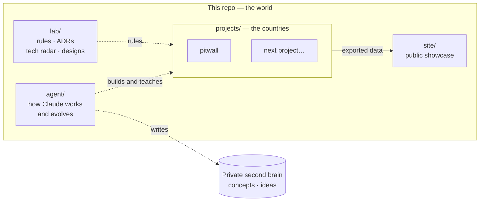

# Data Engineering Lab

Hands-on data engineering projects across clouds and open-source stacks — built to learn deeply and to show the work, by an engineer and an AI teammate.

**Live site:** https://tomasripsky.github.io/data-engineering-lab/

## The world and its countries



The repo is **the world**: the rules every project follows (`lab/`) and the AI teammate that builds with me (`agent/`). Each project under `projects/` is an independent **country** — its own code, dependencies, infrastructure, decisions and docs — that can be read, run and torn down on its own. The public site shows what the countries produce.

## Projects

| Project | What it does | Stack | Status |
|---|---|---|---|
| [pitwall](projects/pitwall/) | Batch ELT over Formula 1 data (OpenF1 → GCS → BigQuery → dbt → Observable site) that explains race strategy — tyres, pit stops and the undercut — to people who don't follow F1. | Python · GCS · BigQuery · dbt · GitHub Actions · Observable | ✅ live — [dashboard](https://tomasripsky.github.io/data-engineering-lab/pitwall/) |

## Navigate

| I want to know… | Go to |
|---|---|
| What a project does and how to run it | `projects/<p>/README.md` |
| How a project works inside | `projects/<p>/docs/guide.md` |
| Why a project made a decision | `projects/<p>/docs/decisions/` |
| How a project was designed and planned | `projects/<p>/docs/design/` |
| The lab's rules | [lab/conventions.md](lab/conventions.md), [lab/security-and-cost.md](lab/security-and-cost.md) |
| Why the lab is built this way | [lab/adr/](lab/adr/) |
| Which tech we use, try, watch or avoid | [lab/tech-radar.md](lab/tech-radar.md) |
| How the AI teammate works | [agent/](agent/) |

## Built with an AI teammate

Every project here is built with [Claude Code](https://claude.com/claude-code) as a senior engineer and tutor: it designs, builds and explains, and I decide. How that collaboration works — the tutoring loop, the memory, the lessons it has learned and how it changes over time — is documented in [`agent/`](agent/).

## Getting started

```bash
git clone https://github.com/TomasRipsky/data-engineering-lab.git
cd data-engineering-lab
pre-commit install   # enables gitleaks, ruff and branch guards on every commit
```
