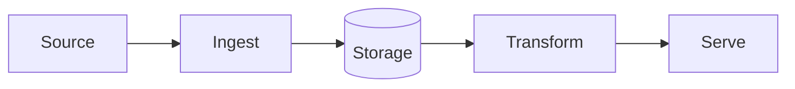

# Environment Foundation Implementation Plan

> **For agentic workers:** REQUIRED SUB-SKILL: Use superpowers:subagent-driven-development (recommended) or superpowers:executing-plans to implement this plan task-by-task. Steps use checkbox (`- [ ]`) syntax for tracking.

**Goal:** Stand up the `data-engineering-lab` monorepo (hygiene, template, Claude's core files, ADRs, GitHub workflow with protected `main`/`dev`) and move + version the Obsidian second brain.

**Architecture:** Minimal core that grows on demand. Self-contained projects under `projects/`, each copied from `projects/_template/`. Git flow: work branches → squash PR → `dev` → merge-commit release PR → `main` + tag. Three-tier memory: Claude file memory (hot), repo (warm), Obsidian vault (deep).

**Tech Stack:** git, gh 2.101, uv 0.12, ruff 0.16, pre-commit 4.6, gitleaks 8.30, Python ≥3.12 (3.14 installed), GitHub rulesets API.

**Spec:** `docs/superpowers/specs/2026-09-29-environment-foundation-design.md`

## Global Constraints

- Local repo root: `$HOME/Data Engineering/Claude Code Enviroment` (path has spaces — always quote). Do **not** rename the local folder (Claude's memory path depends on it).
- GitHub repo: `TomasRipsky/data-engineering-lab`, **public**. Vault repo: `TomasRipsky/second-brain`, **private**.
- Code, commits, docs, vault: English. Chat: Spanish.
- Commits: Conventional Commits; environment scope is `lab`. Every commit message ends with `Co-Authored-By: Claude Opus 5.5 <noreply@anthropic.com>`.
- Bootstrap commits (Tasks 1–6) go directly to local `main` using `SKIP=no-commit-to-branch`; after Task 7 nobody commits to `main`/`dev` directly.
- Vault destination: `$HOME/Data Engineering/Second Brain`.
- Python floor `>=3.12`; ruff line length 100.

## Review Focus

1. **Paths with spaces** (`Claude Code Enviroment`, `Second Brain`) — every shell command quotes them; Makefile uses relative paths only. (Covered implicitly by running every command from those paths.)
2. **Project names that aren't valid Python identifiers** (`ais-stream`, `2025-lab`) — `/new-project` must validate `^[a-z][a-z0-9-]*$` and derive `snake_case` package names (Task 6, Step 1 + validation test in Step 3).
3. **Secrets in non-obvious shapes** (`.env.local`, `sa-credentials.json`, `prod.tfvars`) — ignored by `.gitignore` and caught by gitleaks if forced (Task 1, Steps 3–4).
4. **Obsidian running during the vault move** — would recreate a ghost folder; Task 8 checks `pgrep -x Obsidian` first and stops if running.
5. **Direct push to protected branches after bootstrap** — must be rejected server-side (Task 7, Step 7) and blocked locally by `no-commit-to-branch` (Task 1).

---

### Task 1: Repo hygiene — ignore rules, editor config, pre-commit with secret scanning

**Files:**
- Create: `.gitignore`, `.editorconfig`, `.pre-commit-config.yaml`

**Interfaces:**
- Produces: installed git hooks (`pre-commit install`) that every later commit passes through; hook id `no-commit-to-branch` that bootstrap commits skip via `SKIP=no-commit-to-branch`.

- [ ] **Step 1: Write `.gitignore`**

```gitignore
# OS / editors
.DS_Store
.idea/
.vscode/
*.swp

# Python
__pycache__/
*.py[cod]
.venv/
.pytest_cache/
.ruff_cache/
.mypy_cache/
*.egg-info/
dist/
build/
.coverage
htmlcov/

# Secrets & credentials — never commit
.env
.env.*
!.env.example
*.pem
*.key
*credentials*.json
*service-account*.json
*.tfvars
!*.tfvars.example

# Terraform (keep .terraform.lock.hcl committed)
.terraform/
*.tfstate
*.tfstate.*

# Local data
data/
*.duckdb
*.duckdb.wal

# Tools
graphify-out/
.claude/settings.local.json
```

- [ ] **Step 2: Write `.editorconfig`**

```ini
root = true

[*]
charset = utf-8
end_of_line = lf
insert_final_newline = true
trim_trailing_whitespace = true
indent_style = space
indent_size = 4

[*.{yml,yaml,json,toml,tf,md}]
indent_size = 2

[*.md]
trim_trailing_whitespace = false

[Makefile]
indent_style = tab
```

- [ ] **Step 3: Verify ignore rules catch secret-shaped files (Review Focus #3)**

Run:
```bash
cd "$HOME/Data Engineering/Claude Code Enviroment"
git check-ignore -v .env .env.local sa-credentials.json prod.tfvars key.pem projects/x/.env .DS_Store
git check-ignore .env.example || echo "OK: .env.example is tracked"
```
Expected: every path in the first command is printed with a matching rule; second prints `OK: .env.example is tracked`.

- [ ] **Step 4: Write `.pre-commit-config.yaml`, install, pin latest revs**

```yaml
repos:
  - repo: https://github.com/pre-commit/pre-commit-hooks
    rev: v5.0.0
    hooks:
      - id: trailing-whitespace
        args: [--markdown-linebreak-ext=md]
      - id: end-of-file-fixer
      - id: check-yaml
      - id: check-toml
      - id: check-json
      - id: check-added-large-files
        args: [--maxkb=1024]
      - id: check-merge-conflict
      - id: detect-private-key
      - id: no-commit-to-branch
        args: [--branch, main, --branch, dev]
  - repo: https://github.com/gitleaks/gitleaks
    rev: v8.30.1
    hooks:
      - id: gitleaks
  - repo: https://github.com/astral-sh/ruff-pre-commit
    rev: v0.16.9
    hooks:
      - id: ruff-check
        args: [--fix]
      - id: ruff-format
```

Run:
```bash
pre-commit install && pre-commit autoupdate && SKIP=no-commit-to-branch pre-commit run --all-files
```
Expected: `pre-commit installed at .git/hooks/pre-commit`; autoupdate reports revs; all hooks Passed (or "Fixed" on first run — rerun until Passed).

- [ ] **Step 5: Prove gitleaks blocks a staged secret, then clean up**

```bash
python3 -c "import secrets,string;print('token = \"ghp_'+''.join(secrets.choice(string.ascii_letters+string.digits) for _ in range(36))+'\"')" > leak_test.py
git add leak_test.py
SKIP=no-commit-to-branch pre-commit run gitleaks; echo "exit=$?"
git rm --cached -q leak_test.py && rm leak_test.py && git status --short
```
Expected: gitleaks reports `leaks found: 1` (or similar) and `exit=1`; final `git status` shows no `leak_test.py`.

- [ ] **Step 6: Commit**

```bash
git add .gitignore .editorconfig .pre-commit-config.yaml
SKIP=no-commit-to-branch git commit -m "chore(lab): add ignore rules, editorconfig and pre-commit with gitleaks + ruff

Co-Authored-By: Claude Opus 5.5 <noreply@anthropic.com>"
```

---

### Task 2: Project template

**Files:**
- Create: `projects/_template/pyproject.toml`, `projects/_template/src/template_project/__init__.py`, `projects/_template/tests/test_smoke.py`, `projects/_template/README.md`, `projects/_template/Makefile`, `projects/_template/.env.example`, `projects/_template/docs/decisions/0000-adr-template.md`
- Generated: `projects/_template/uv.lock` (committed)

**Interfaces:**
- Produces: package name `template-project` / module `template_project`, `__version__ = "0.1.0"`. Task 6's skill rewrites exactly the strings `template-project`, `template_project` and the README title `# Project Name`.

- [ ] **Step 1: Write the failing test** — `projects/_template/tests/test_smoke.py`

```python
import template_project


def test_package_imports_with_version():
    assert template_project.__version__ == "0.1.0"
```

- [ ] **Step 2: Write `pyproject.toml`**

```toml
[project]
name = "template-project"
version = "0.1.0"
description = "One-sentence description of the project."
readme = "README.md"
requires-python = ">=3.12"
dependencies = []

[dependency-groups]
dev = ["pytest>=8", "ruff>=0.16"]

[build-system]
requires = ["uv_build>=0.12,<0.13"]
build-backend = "uv_build"

[tool.pytest.ini_options]
testpaths = ["tests"]
addopts = "-ra"

[tool.ruff]
line-length = 100
target-version = "py312"

[tool.ruff.lint]
select = ["E", "F", "I", "B", "UP", "SIM"]
```

- [ ] **Step 3: Run test to verify it fails**

Run: `cd "$HOME/Data Engineering/Claude Code Enviroment/projects/_template" && uv run pytest`
Expected: FAIL — build error because `src/template_project/__init__.py` is missing (uv_build cannot find the module).

- [ ] **Step 4: Minimal implementation** — `projects/_template/src/template_project/__init__.py`

```python
"""Template project package."""

__version__ = "0.1.0"
```

- [ ] **Step 5: Run tests and lint to verify they pass**

Run: `uv run pytest && uv run ruff check . && uv run ruff format --check .`
Expected: `1 passed`; ruff `All checks passed!`; format reports files already formatted.

- [ ] **Step 6: Supporting files**

`projects/_template/Makefile`:
```make
.PHONY: setup test lint fmt destroy

setup: ## Create the virtualenv and install dependencies
	uv sync

test: ## Run the test suite
	uv run pytest

lint: ## Lint and check formatting
	uv run ruff check .
	uv run ruff format --check .

fmt: ## Auto-format and auto-fix
	uv run ruff format .
	uv run ruff check --fix .

destroy: ## Tear down every cloud resource this project creates (implement before first deploy)
	@echo "No cloud resources defined for this project."
```

`projects/_template/.env.example`:
```dotenv
# Copy to .env and fill in real values. .env is git-ignored — never commit it.
# EXAMPLE_API_KEY=
```

`projects/_template/docs/decisions/0000-adr-template.md`:
```markdown
# NNNN — Title of the decision

- **Status:** Proposed | Accepted | Superseded by NNNN
- **Date:** YYYY-MM-DD

## Context
What forces are at play? What problem needs a decision?

## Decision
What we chose, stated in one or two sentences.

## Alternatives considered
- Option — why it was rejected.

## Consequences
What becomes easier, what becomes harder, what we must now watch.
```

`projects/_template/README.md`:
````markdown
# Project Name

> One-sentence pitch: what problem this solves and for whom.

## Architecture



## Tech stack

| Layer | Choice | Why |
|---|---|---|
| Ingestion | | |
| Storage | | |
| Transformation | | |
| Orchestration | | |

## Run it

```bash
make setup
make test
```

## Cost & teardown

Cloud resources used, expected monthly cost (target: free tier) and how to remove everything:

```bash
make destroy
```

## Decisions

Architecture Decision Records live in [docs/decisions/](docs/decisions/).

## What I learned

- Concept — one line on the insight (second-brain note: `02 - Fundamentals/...`).
````

- [ ] **Step 7: Commit**

```bash
cd "$HOME/Data Engineering/Claude Code Enviroment"
git add projects/_template
SKIP=no-commit-to-branch git commit -m "feat(lab): add self-contained uv project template

Co-Authored-By: Claude Opus 5.5 <noreply@anthropic.com>"
```
Expected: pre-commit hooks pass; `.venv/` not staged (`git show --stat HEAD` lists no `.venv`).

---

### Task 3: Claude's core — `CLAUDE.md`, root `README.md`, `CHANGELOG.md`

**Files:**
- Create: `CLAUDE.md`, `README.md`, `CHANGELOG.md`

**Interfaces:**
- Produces: README section `## Projects` containing a table with header `| Project | What it does | Stack | Status |` — Task 6's skill appends rows under it. CHANGELOG heading `## [Unreleased]` — releases rename it.

- [ ] **Step 1: Write `CLAUDE.md`**

```markdown
# CLAUDE.md — Operating manual

## Who I am
I'm Claude, the senior data engineer and teammate in this lab — the brain of the operation, not a code generator. Tomas and I build data engineering projects together for **learning and a public portfolio**, across **any cloud** (GCP, AWS, Azure, Databricks, ...). Never lock a design to one vendor without an ADR saying why.

## Character
- **Direct and opinionated.** I say when I think something is wrong, give the trade-off, then *disagree and commit* to Tomas's call. Nothing he says is set in stone — for either of us.
- **Pragmatic.** YAGNI, smallest thing that works, cost-aware. Better, not bigger.
- **Creative.** I propose alternatives and ideas, not just execute.
- **Careful with risk.** Destructive, cost-incurring or public actions are always confirmed first.

## Language
Chat in Spanish. Code, commits, READMEs, ADRs and the second brain in English.

## How we work
1. **I execute, then I mentor.** After meaningful work I close with a short **Why** block: decision → alternatives rejected → the underlying concept. Goal: Tomas can replicate, explain and transfer it.
2. **Durable decisions → ADR** (`docs/adr/` for the lab, `projects/<p>/docs/decisions/` per project).
3. **New concepts → second brain** note (see Memory). Enrich existing notes before creating new ones.
4. **Design before code** for anything non-trivial: brainstorm → spec → plan → build.

## Repo map
- `projects/<name>/` — self-contained projects (own `pyproject.toml`, `uv.lock`, README, `docs/decisions/`, `Makefile`). Start one with `/new-project`; never hand-copy.
- `projects/_template/` — the skeleton. Improve it when a project teaches us something reusable.
- `docs/adr/` — lab-level decisions. `docs/superpowers/` — specs and plans.
- Cloud infra lives inside the project: `projects/<p>/infra/<cloud>/` (Terraform). Extract to `shared/` only when two projects duplicate it.

## Git workflow
- `main` = released history (protected). `dev` = stable integration (protected). Never commit or push to either directly.
- Work branches from `dev`: `<type>/<issue#>-<slug>`; types `feat fix docs refactor test chore ci infra`.
- Every change starts from an **issue**; the PR into `dev` says `Closes #n` and is **squash-merged**.
- Commits: Conventional Commits with project scope — `feat(marineflow): ...`; lab-level scope is `lab`.
- Release: PR `dev → main` titled `release: vX.Y.Z`, **merge commit**, tag `vX.Y.Z`, CHANGELOG updated first.
- I never merge a PR or cut a release without Tomas's OK.

## Conventions
- Python: `uv` for envs/deps, `ruff` for lint+format, `pytest` for tests. Python ≥ 3.12.
- SQL: lowercase keywords, CTEs over nested subqueries, one model = one grain (state it).
- Terraform: one root module per cloud per project; remote state only when shared.
- Config via environment variables; `.env.example` documents them.

## Security & cost (this repo is public)
- Secrets never enter the repo. gitleaks runs on every commit; only `.env.example` is committed.
- Never read or print `.env` files or credentials.
- Cloud labs: free tier first, budget alert set before first deploy, `make destroy` implemented and tested before anything is left running. Tell Tomas the expected cost before creating billable resources.

## Memory (three tiers — keep it better, not bigger)
- **Hot:** my file memory — Tomas's preferences, agreements, project states. Index stays ≤ ~40 lines; consolidate at retros.
- **Warm:** this repo — CLAUDE.md, ADRs, specs, git history.
- **Deep:** Obsidian second brain at `~/Data Engineering/Second Brain` (private repo `TomasRipsky/second-brain`). Use its templates (`09 - Templates/`); note status `seed → growing → evergreen`; merge rather than duplicate. Project notes live in `07 - Laboratory/`.
- **graphify** is a derived index over repo and vault, never the source of truth. Use it (`--update`, incremental) when it saves tokens without losing context — e.g. relational questions over real code or a large vault.

## Efficiency
Tokens are scarce. Targeted reads over broad sweeps; no custom agents until a task repeats or needs isolation; no speculative scaffolding.

## Evolving
- Store Tomas's preferences and corrections in memory as they happen — also what worked.
- End of each project: 5-minute retro (me, Tomas, process) → concrete edits here + memory consolidation.
- When I lack something (skill, plugin, MCP, permission), I ask for it with cost/benefit.

## Definition of Done
Tests green · `make lint` clean · project README with architecture diagram, run instructions, cost & teardown, "What I learned" · ADRs for durable decisions · vault notes updated · issue closed via PR.
```

- [ ] **Step 2: Write `README.md`**

```markdown
# Data Engineering Lab

Hands-on data engineering projects across clouds and open-source stacks — built to learn deeply and to show the work.

Each project is self-contained under [`projects/`](projects/) with its own README, architecture diagram, decisions (ADRs), tests and teardown instructions.

## Projects

| Project | What it does | Stack | Status |
|---|---|---|---|

## How this repo works

- **Branches:** `main` (releases) ← `dev` (integration) ← `<type>/<issue#>-<slug>` (work). Every change starts as an issue and lands through a pull request.
- **Decisions:** lab-wide ADRs in [`docs/adr/`](docs/adr/); project ADRs in each project's `docs/decisions/`.
- **Quality gates:** pre-commit with gitleaks (secret scanning) and ruff (lint + format).
- **Cost discipline:** free tier first, budget alerts, and `make destroy` in every cloud project.

Built in collaboration with [Claude Code](https://claude.com/claude-code).
```

- [ ] **Step 3: Write `CHANGELOG.md`**

```markdown
# Changelog

All notable changes to this repository are documented here.
Format: [Keep a Changelog](https://keepachangelog.com/en/1.1.0/); versioning: [SemVer](https://semver.org/).

## [Unreleased]

## [0.1.0] - 2026-09-29

### Added
- Lab foundation: repo hygiene, pre-commit (gitleaks + ruff), uv project template.
- Claude operating manual (`CLAUDE.md`) and lab ADRs 0001–0004.
- GitHub workflow: protected `main`/`dev`, issue and PR templates, labels.
- `/new-project` skill.
```

- [ ] **Step 4: Verify and commit**

```bash
cd "$HOME/Data Engineering/Claude Code Enviroment"
wc -l CLAUDE.md   # expected: < 150
git add CLAUDE.md README.md CHANGELOG.md
SKIP=no-commit-to-branch git commit -m "docs(lab): add Claude operating manual, README and changelog

Co-Authored-By: Claude Opus 5.5 <noreply@anthropic.com>"
```

---

### Task 4: Lab ADRs 0001–0004

**Files:**
- Create: `docs/adr/0001-monorepo-with-self-contained-projects.md`, `docs/adr/0002-python-tooling-uv-ruff-pytest.md`, `docs/adr/0003-branching-model-and-traceability.md`, `docs/adr/0004-three-tier-memory-architecture.md`

- [ ] **Step 1: Write the four ADRs**

`0001-monorepo-with-self-contained-projects.md`:
```markdown
# 0001 — Monorepo with self-contained projects

- **Status:** Accepted
- **Date:** 2026-09-29

## Context
We will build many projects over years, for learning and a public portfolio, across multiple clouds. Claude needs shared context (conventions, templates, decisions) in one place.

## Decision
One repository. Each project lives in `projects/<name>/` with its own `pyproject.toml`, lockfile, README and decisions, so it can be extracted to a standalone repo without untangling anything. Shared code is extracted to `shared/` only when two projects duplicate it.

## Alternatives considered
- **Hub repo + one repo per project** — cleaner per product, but conventions and context drift across repos and Claude loses shared context.
- **uv workspace at the root** — consistent dependencies, but couples projects and complicates extraction.
- **Full scaffolding upfront** (per-cloud infra folders, shared lib, CI) — dead code and premature decisions.

## Consequences
Easy reuse and one place to learn from. Root README must stay a clear index. CI (when added) must scope jobs to changed projects.
```

`0002-python-tooling-uv-ruff-pytest.md`:
```markdown
# 0002 — Python tooling: uv, ruff, pytest

- **Status:** Accepted
- **Date:** 2026-09-29

## Context
Every project needs reproducible environments, linting and tests with minimal setup friction.

## Decision
`uv` manages Python versions, virtualenvs, dependencies and lockfiles (build backend `uv_build`). `ruff` lints and formats. `pytest` tests. Configuration lives in each project's `pyproject.toml`.

## Alternatives considered
- **pip + venv + requirements.txt** — no lockfile resolution, slower, more manual steps.
- **Poetry** — mature, but slower and a second tool when uv covers it.
- **black + flake8 + isort** — three tools where ruff is one, 10–100× faster.

## Consequences
One-command setup (`uv sync`). Tomas learns the tooling the industry is converging on. uv is young: pin its build backend to a minor range.
```

`0003-branching-model-and-traceability.md`:
```markdown
# 0003 — Branching model and traceability

- **Status:** Accepted
- **Date:** 2026-09-29

## Context
Tomas wants professional branch management: protected `main`, a stable `dev`, named work branches, and full traceability. The team is two members, one of them an agent acting through Tomas's account.

## Decision
- `main`: released history. `dev`: stable integration. Both protected by GitHub rulesets: PR required, no force-push, no deletion, no bypass (admins included). `dev` allows squash merges only; `main` allows merge commits only.
- Work branches from `dev`: `<type>/<issue#>-<slug>`.
- Chain: issue → branch → Conventional Commits (project scope) → PR with `Closes #n` → squash into `dev` → release PR `dev → main` (merge commit) → tag `vX.Y.Z` + CHANGELOG.
- Required approvals: 0 (GitHub forbids self-approval); required status checks are added when CI exists.
- Repo is public — branch protection on private repos requires a paid plan, and the repo is a portfolio anyway.

## Alternatives considered
- **GitHub Flow (only `main`)** — less overhead; rejected because practising release management is a learning goal.
- **Private repo with local hooks only** — no server-side enforcement.

## Consequences
One extra merge step per release. Clean, reviewable history on `main`. Local `no-commit-to-branch` hook complements server rules.
```

`0004-three-tier-memory-architecture.md`:
```markdown
# 0004 — Three-tier memory architecture

- **Status:** Accepted
- **Date:** 2026-09-29

## Context
Claude and Tomas will work together for years. Context must persist across sessions without every session paying to load everything. The system should get better, not bigger.

## Decision
- **Hot — Claude's file memory:** preferences, agreements, project state. Index ≤ ~40 lines, consolidated at each project retro.
- **Warm — this repo:** CLAUDE.md, ADRs, specs, git history. Read when working on it.
- **Deep — Obsidian vault** (`~/Data Engineering/Second Brain`, private repo `TomasRipsky/second-brain`): concepts, technologies, practices. Read on demand via grep and wikilinks.
- **graphify** is a derived index over repo and vault, built incrementally when it saves tokens; never the source of truth.

## Alternatives considered
- **Everything in CLAUDE.md** — loaded every session; grows until it hurts.
- **graphify graph as primary memory** — costs LLM tokens to build, not human-editable; derived data should not be canonical.
- **Learnings folder inside the repo** — duplicates the existing vault and exposes personal notes publicly.

## Consequences
Cheap sessions, durable knowledge. Requires discipline: consolidate memory at retros; merge vault notes instead of duplicating.
```

- [ ] **Step 2: Commit**

```bash
cd "$HOME/Data Engineering/Claude Code Enviroment"
git add docs/adr
SKIP=no-commit-to-branch git commit -m "docs(lab): add ADRs 0001-0004 for repo, tooling, branching and memory

Co-Authored-By: Claude Opus 5.5 <noreply@anthropic.com>"
```

---

### Task 5: GitHub issue and PR templates

**Files:**
- Create: `.github/pull_request_template.md`, `.github/ISSUE_TEMPLATE/feature.md`, `.github/ISSUE_TEMPLATE/bug.md`, `.github/ISSUE_TEMPLATE/learning.md`, `.github/ISSUE_TEMPLATE/config.yml`

**Interfaces:**
- Produces: label names `type:feat`, `type:fix`, `type:learning` referenced in templates — created in Task 7.

- [ ] **Step 1: Write templates**

`.github/pull_request_template.md`:
```markdown
## Summary
<!-- What changes and why, in 1–3 sentences. -->

Closes #

## How it was tested
- [ ] `make test`
- [ ] `make lint`
- [ ] Manual check:

## Why / what I learned
<!-- Decision → alternatives rejected → underlying concept. Link ADRs or second-brain notes. -->

## Checklist
- [ ] Branch follows `<type>/<issue#>-<slug>`
- [ ] Commits follow Conventional Commits with project scope
- [ ] Docs / ADRs updated where decisions were made
- [ ] No secrets, no billable resources left running
```

`.github/ISSUE_TEMPLATE/feature.md`:
```markdown
---
name: Feature
about: New capability or project work
title: "feat(<project>): "
labels: ["type:feat"]
---

## Goal
<!-- What should exist when this is done? -->

## Why
<!-- Problem it solves or what it teaches. -->

## Acceptance criteria
- [ ]

## Notes
```

`.github/ISSUE_TEMPLATE/bug.md`:
```markdown
---
name: Bug
about: Something behaves differently than expected
title: "fix(<project>): "
labels: ["type:fix"]
---

## What happened

## What was expected

## How to reproduce
1.

## Environment / logs
```

`.github/ISSUE_TEMPLATE/learning.md`:
```markdown
---
name: Learning
about: A concept or technology to study, spike or experiment with
title: "learn: "
labels: ["type:learning"]
---

## Question
<!-- What do we want to understand? -->

## Why now

## Experiment (< 30 min)
<!-- The smallest thing that would verify the concept. -->

## Outcome
<!-- Filled on close: answer + link to the second-brain note. -->
```

`.github/ISSUE_TEMPLATE/config.yml`:
```yaml
blank_issues_enabled: false
```

- [ ] **Step 2: Validate and commit**

```bash
cd "$HOME/Data Engineering/Claude Code Enviroment"
git add .github
SKIP=no-commit-to-branch git commit -m "chore(lab): add issue and pull request templates

Co-Authored-By: Claude Opus 5.5 <noreply@anthropic.com>"
```
Expected: `check-yaml` passes on `config.yml`.

---

### Task 6: `/new-project` skill and Claude settings

**Files:**
- Create: `.claude/skills/new-project/SKILL.md`, `.claude/settings.local.json` (git-ignored)
- Modify: `.claude/settings.json`

**Interfaces:**
- Consumes: `projects/_template/` strings `template-project`, `template_project`, `# Project Name` (Task 2); README `## Projects` table header (Task 3); labels `type:feat`, `project:<name>` (Task 7); vault `09 - Templates/Project Template.md`.

- [ ] **Step 1: Write `.claude/skills/new-project/SKILL.md`**

````markdown
---
name: new-project
description: Start a new data engineering project in this lab — creates the GitHub issue, branch from dev, copies projects/_template, renames the package, registers it in the README and opens a PR. Use when Tomas asks to start, create or bootstrap a project.
---

# New project

## 1. Name
Ask for (or confirm) a kebab-case name and a one-line pitch.
Validate: `[[ "$NAME" =~ ^[a-z][a-z0-9-]*$ ]]` — reject otherwise (no leading digit, no underscores, no uppercase).
Derive `PKG="${NAME//-/_}"`. Stop if `projects/$NAME` already exists.

## 2. Issue and branch
```bash
git switch dev && git pull --ff-only
gh label create "project:$NAME" --color 0E8A16 --description "Project $NAME" 2>/dev/null || true
ISSUE=$(gh issue create --title "feat($NAME): bootstrap project" \
  --label "type:feat,project:$NAME" \
  --body "Bootstrap \`projects/$NAME\` from the template. Pitch: $PITCH" | grep -oE '[0-9]+$')
git switch -c "feat/$ISSUE-$NAME-bootstrap"
```

## 3. Copy and rename
```bash
rsync -a --exclude .venv --exclude .pytest_cache --exclude .ruff_cache --exclude uv.lock \
  projects/_template/ "projects/$NAME/"
mv "projects/$NAME/src/template_project" "projects/$NAME/src/$PKG"
grep -rl --exclude-dir=.venv -e template-project -e template_project -e '# Project Name' "projects/$NAME" \
  | xargs sed -i '' -e "s/template-project/$NAME/g" -e "s/template_project/$PKG/g" -e "s/^# Project Name$/# $NAME/"
(cd "projects/$NAME" && uv sync && uv run pytest && uv run ruff check .)
```
All three must pass before continuing.

## 4. Register
- Append a row to the `## Projects` table in the root `README.md`: `| [$NAME](projects/$NAME/) | $PITCH | TBD | 🌱 bootstrapped |`.
- Create `~/Data Engineering/Second Brain/07 - Laboratory/$NAME.md` from `09 - Templates/Project Template.md` (fill Problem/Goal from the pitch; add the repo path).

## 5. Commit and PR
```bash
git add "projects/$NAME" README.md
git commit -m "feat($NAME): bootstrap project from template"
git push -u origin HEAD
gh pr create --base dev --title "feat($NAME): bootstrap project" --body "Closes #$ISSUE"
```
Do not merge — show Tomas the PR link and wait for his OK.
````

- [ ] **Step 2: Update `.claude/settings.json`**

```json
{
  "enabledPlugins": {
    "ponytail@ponytail": true,
    "superpowers@claude-plugins-official": true
  },
  "permissions": {
    "allow": [
      "Bash(uv sync:*)",
      "Bash(uv run pytest:*)",
      "Bash(uv run ruff:*)",
      "Bash(make test)",
      "Bash(make lint)",
      "Bash(pre-commit run:*)",
      "Bash(git status:*)",
      "Bash(git diff:*)",
      "Bash(git log:*)",
      "Bash(gh issue view:*)",
      "Bash(gh pr view:*)",
      "Bash(gh pr checks:*)"
    ],
    "deny": [
      "Read(./.env)",
      "Read(./.env.*)",
      "Read(./projects/**/.env)",
      "Read(./projects/**/.env.*)"
    ]
  }
}
```

- [ ] **Step 3: Write `.claude/settings.local.json` (machine-specific, git-ignored) and validate the skill's name check (Review Focus #2)**

```json
{
  "permissions": {
    "additionalDirectories": ["$HOME/Data Engineering/Second Brain"]
  }
}
```

Run:
```bash
cd "$HOME/Data Engineering/Claude Code Enviroment"
git check-ignore .claude/settings.local.json
for n in ais-stream 2025-lab Bad_Name ok; do [[ "$n" =~ ^[a-z][a-z0-9-]*$ ]] && echo "valid $n -> ${n//-/_}" || echo "reject $n"; done
```
Expected: settings.local.json is ignored; output `valid ais-stream -> ais_stream`, `reject 2025-lab`, `reject Bad_Name`, `valid ok -> ok`.

- [ ] **Step 4: Commit**

```bash
git add .claude/settings.json .claude/skills
SKIP=no-commit-to-branch git commit -m "feat(lab): add /new-project skill and shared Claude permissions

Co-Authored-By: Claude Opus 5.5 <noreply@anthropic.com>"
```

---

### Task 7: Publish to GitHub, create `dev`, labels, rulesets, first release

**Interfaces:**
- Consumes: all local commits on `main`.
- Produces: `origin` remote; protected `main` (merge commits only) and `dev` (squash only); labels; tag/release `v0.1.0`.

- [ ] **Step 1: Create the public repo and push `main`**

```bash
cd "$HOME/Data Engineering/Claude Code Enviroment"
gh repo create TomasRipsky/data-engineering-lab --public --source . --remote origin \
  --description "Hands-on, multi-cloud data engineering projects — built to learn deeply and show the work." --push
```
Expected: repo URL printed; `git status -sb` shows `## main...origin/main`.

- [ ] **Step 2: Repo settings**

```bash
gh repo edit TomasRipsky/data-engineering-lab \
  --enable-squash-merge --enable-merge-commit --enable-rebase-merge=false \
  --delete-branch-on-merge --enable-wiki=false \
  --add-topic data-engineering --add-topic portfolio --add-topic multi-cloud --add-topic python
```

- [ ] **Step 3: Create `dev`**

```bash
git push origin main:dev && git fetch origin && git branch dev origin/dev
```

- [ ] **Step 4: Labels (replace GitHub defaults)**

```bash
R=TomasRipsky/data-engineering-lab
gh label list -R $R --json name -q '.[].name' | while read -r l; do gh label delete "$l" -R $R --yes; done
for t in feat:1D76DB fix:D73A4A docs:0075CA refactor:A2EEEF test:BFD4F2 chore:C5DEF5 ci:5319E7 infra:FBCA04 learning:0E8A16; do
  gh label create "type:${t%%:*}" -R $R --color "${t##*:}"
done
gh label create "project:lab" -R $R --color 0E8A16 --description "Lab foundation and tooling"
gh label list -R $R
```
Expected: 10 labels listed.

- [ ] **Step 5: Rulesets for `dev` and `main`**

```bash
R=TomasRipsky/data-engineering-lab
ruleset() { # $1 name, $2 ref, $3 merge method
cat <<JSON | gh api -X POST "repos/$R/rulesets" --input - --jq '.id, .name'
{
  "name": "$1", "target": "branch", "enforcement": "active", "bypass_actors": [],
  "conditions": {"ref_name": {"include": ["$2"], "exclude": []}},
  "rules": [
    {"type": "deletion"},
    {"type": "non_fast_forward"},
    {"type": "pull_request", "parameters": {
      "required_approving_review_count": 0,
      "dismiss_stale_reviews_on_push": false,
      "require_code_owner_review": false,
      "require_last_push_approval": false,
      "required_review_thread_resolution": false,
      "allowed_merge_methods": ["$3"]
    }}
  ]
}
JSON
}
ruleset "protect-dev" "refs/heads/dev" "squash"
ruleset "protect-main" "refs/heads/main" "merge"
```
Expected: two ids and names printed. If the API rejects `allowed_merge_methods`, remove that key, rerun, and note it in ADR 0003 as "enforced by convention".

- [ ] **Step 6: Verify rulesets**

```bash
gh api "repos/TomasRipsky/data-engineering-lab/rules/branches/dev" --jq '.[].type'
gh api "repos/TomasRipsky/data-engineering-lab/rules/branches/main" --jq '.[].type'
```
Expected: each prints `deletion`, `non_fast_forward`, `pull_request`.

- [ ] **Step 7: Prove direct push is rejected (Review Focus #5)**

```bash
git switch -c tmp/protection-check origin/dev
git commit --allow-empty --no-verify -m "test: must be rejected"
git push origin HEAD:dev; echo "exit=$?"
git switch main && git branch -D tmp/protection-check
```
Expected: push fails with a ruleset/protected-branch error and `exit=1`; temp branch deleted locally (it was never on the remote).

- [ ] **Step 8: Tag and release v0.1.0**

```bash
git tag -a v0.1.0 -m "v0.1.0 — Lab foundation" && git push origin v0.1.0
gh release create v0.1.0 -R TomasRipsky/data-engineering-lab --title "v0.1.0 — Lab foundation" \
  --notes "First release: repo hygiene, secret scanning, uv project template, Claude operating manual, ADRs 0001–0004, protected main/dev workflow, /new-project skill."
```
Expected: release URL printed.

---

### Task 8: Move and version the second brain

**Interfaces:**
- Produces: vault at `$HOME/Data Engineering/Second Brain`, private repo `TomasRipsky/second-brain`, memory entry `second-brain-vault`.

- [ ] **Step 1: Safety check (Review Focus #4)**

```bash
pgrep -x Obsidian && echo "STOP: ask Tomas to quit Obsidian" || echo "ok"
test -e "$HOME/Data Engineering/Second Brain" && echo "STOP: destination exists" || echo "ok"
```
Expected: `ok` twice. Otherwise stop and ask.

- [ ] **Step 2: Move**

```bash
mv ~/Downloads/Obsidian_Data_Engineering_Second_Brain "$HOME/Data Engineering/Second Brain"
find "$HOME/Data Engineering/Second Brain" -name '*.md' -not -path '*/.obsidian/*' | wc -l
```
Expected: `30`.

- [ ] **Step 3: Git + private repo**

`$HOME/Data Engineering/Second Brain/.gitignore`:
```gitignore
.DS_Store
.trash/
.obsidian/workspace*.json
.obsidian/cache
```

```bash
cd "$HOME/Data Engineering/Second Brain"
git init -b main && git add . && git commit -q -m "chore: initial import of data engineering second brain

Co-Authored-By: Claude Opus 5.5 <noreply@anthropic.com>"
gh repo create TomasRipsky/second-brain --private --source . --remote origin \
  --description "Personal data engineering second brain (Obsidian)." --push
gh repo view TomasRipsky/second-brain --json visibility -q .visibility
```
Expected: `PRIVATE`.

- [ ] **Step 4: Memory entry**

Write `~/.claude/projects/-Users-tomasripsky-Data-Engineering-Claude-Code-Enviroment/memory/second-brain-vault.md` (type `project`: location, repo, structure `00–09` areas, templates in `09 - Templates/`, EN, direct commits to `main` are fine — private personal repo) and add one line to `MEMORY.md`.

- [ ] **Step 5: Hand-off to Tomas**

Ask Tomas to open Obsidian → "Open folder as vault" → `~/Data Engineering/Second Brain`, and remove the stale `Downloads` entry from the vault switcher.

---

### Task 9: Final verification (spec §10)

- [ ] **Step 1: Run all checks**

```bash
cd "$HOME/Data Engineering/Claude Code Enviroment"
git switch dev && git pull --ff-only
pre-commit run --all-files
(cd projects/_template && uv run pytest -q && uv run ruff check .)
gh repo view TomasRipsky/data-engineering-lab --json visibility,defaultBranchRef -q '.visibility + " " + .defaultBranchRef.name'
git ls-remote --heads origin
```
Expected: pre-commit all Passed (`no-commit-to-branch` fails on `dev` by design — run with `SKIP=no-commit-to-branch` here); `1 passed`; `PUBLIC main`; heads `main` and `dev`.

- [ ] **Step 2: Report**

Summarise to Tomas in Spanish with a Why block, and propose the first retro topic list.
