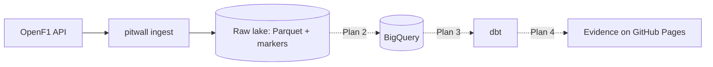

# pitwall — Plan 1: OpenF1 extractor → lake

> **For agentic workers:** REQUIRED SUB-SKILL: Use superpowers:subagent-driven-development (recommended) or superpowers:executing-plans to implement this plan task-by-task. Steps use checkbox (`- [ ]`) syntax for tracking.

**Goal:** A tested `pitwall ingest` CLI that pulls Race/Sprint data for any Grand Prix from OpenF1 and writes contract-checked Parquet plus a success marker to a lake URI (local path now, `gs://` in Plan 2), idempotently.

**Architecture:** Four focused modules — `contracts` (per-endpoint pyarrow schemas + casting), `client` (rate-limited, retrying HTTP client where "No results found" 404 = empty), `lake` (pyarrow filesystem wrapper + path conventions + markers), `ingest` (season refresh, meeting selection, atomic meeting ingestion) — and a thin `cli`. Everything is buffered and validated in memory before any write; the marker is deleted first and written last.

**Tech Stack:** Python ≥ 3.12, uv, httpx (with `httpx.MockTransport` for tests), pyarrow (`pyarrow.fs`, `pyarrow.parquet`), pytest, ruff.

**Spec:** `docs/superpowers/specs/2026-09-29-pitwall-design.md`

## Roadmap (one plan per subsystem; each written when the previous one ships)

| Plan | Delivers | Spec sections | ADRs |
|---|---|---|---|
| **1 — Extractor → lake** (this plan) | `pitwall ingest` against a local lake, fully tested | 4, 10 | 1, 2 |
| 2 — GCP infra + loader | `make bootstrap`, Terraform (buckets, datasets, SAs, WIF, quota), `pitwall load`, dev ingested from the laptop, destroy/apply tested on dev | 5, 9 | 3, 6, 7 |
| 3 — dbt models | staging → intermediate → marts, tests, unit tests, pit-stop fallback from stints | 6, 10 | — |
| 4 — CI/CD + dashboard | CI and pipeline workflows, prod environment, Evidence on Pages, prod backfill, final README, release | 7, 8 | 4, 5 |

Lessons from each plan may change the next ones; the spec is updated in the same PR when they do.

## Global Constraints

- Python `>=3.12`; deps managed with `uv` (`uv add`, never hand-edited versions); ruff line length 100 (template config).
- Runtime dependencies for Plan 1: **only** `httpx` and `pyarrow`. No mocking libraries: use `httpx.MockTransport` and injected `sleep`/`clock` callables.
- Lake root comes from env var `PITWALL_LAKE_URI` (a plain path, `file://` URI or `gs://` URI). No cloud access in Plan 1.
- Rate limit: at most 30 requests/min → `min_interval = 2.1` s between requests.
- OpenF1 "no data" = HTTP 404 with body exactly `{"detail": "No results found."}` → empty list. Any other 404 fails.
- Race and Sprint sessions = `session_type == "Race"`; ignore `is_cancelled == true`. A meeting is ingestible once its last race session ended ≥ 6 h ago.
- OpenF1 historical data starts in **2023**.
- Lake paths: `raw/<endpoint>/season=<year>/part.parquet` (season level), `raw/<endpoint>/season=<year>/meeting_key=<key>/part.parquet` (meeting level), `raw/_success/season=<year>/meeting_key=<key>.json` (marker).
- Every Parquet file carries `_ingested_at` (UTC timestamp).
- Code, comments, commits and docs in English; commits are Conventional Commits with scope `pitwall`; never commit to `dev`/`main` directly.

## Review Focus

1. **The repo path contains spaces** (`Data Engineering/Claude Code Enviroment`): a local lake path or `file://` URI with `%20` must resolve to the same directory → test in Task 4.
2. **A run that dies halfway through rewriting a meeting** must not leave the old marker next to half-new files → marker deleted before writes; test in Task 6.
3. **Meetings that must not be ingested** — pre-season testing (no Race session), cancelled sessions, races that ended < 6 h ago, sessions without `date_end` → excluded; tests in Task 5.
4. **Mixed or drifting types from the API** — `gap_to_leader` is `0`, `11.097` or `"+1 LAP"`; ints arrive as `1.0`; a scalar field suddenly holds a list → stringify / accept whole floats / fail loudly; tests in Task 2.
5. **`--season 2022` or earlier** would silently ingest nothing → CLI rejects it with a clear message; test in Task 7.

---

### Task 1: Bootstrap the project and open the extractor branch

**Files:**
- Create (via skill): `projects/pitwall/**` from `projects/_template`
- Modify (via skill): root `README.md` projects table; vault `07 - Laboratory/pitwall.md`

**Interfaces:**
- Produces: package `pitwall` at `projects/pitwall/src/pitwall/`, working `uv run pytest`.

- [ ] **Step 1: Run the `/new-project` skill**

Name: `pitwall`. Pitch (use verbatim):
`Batch ELT over Formula 1 data (OpenF1 → GCS → BigQuery → dbt → Evidence) that explains race strategy — tyres, pit stops and the undercut — to people who don't follow F1.`

The skill creates the issue, branch `feat/<n>-pitwall-bootstrap`, copies the template, registers the project and opens a PR into `dev`.

- [ ] **Step 2: Get Tomas's OK and squash-merge the bootstrap PR**

```bash
gh pr merge <pr-number> --squash --delete-branch
```

- [ ] **Step 3: Open the extractor issue and branch**

```bash
cd "/Users/tomasripsky/Data Engineering/Claude Code Enviroment"
git switch dev && git pull --ff-only
URL=$(gh issue create --title "feat(pitwall): OpenF1 extractor to raw lake" \
  --label "type:feat,project:pitwall" \
  --body "Plan 1 of pitwall: docs/superpowers/plans/2026-09-29-pitwall-1-extractor.md")
ISSUE=${URL##*/}
git switch -c "feat/$ISSUE-pitwall-extractor"
```

- [ ] **Step 4: Add runtime dependencies and the console script**

```bash
cd projects/pitwall && uv add httpx pyarrow
```

Then add to `projects/pitwall/pyproject.toml` (below `dependencies`):

```toml
[project.scripts]
pitwall = "pitwall.cli:main"
```

Run: `uv sync && uv run pytest`
Expected: the template smoke test passes.

- [ ] **Step 5: Commit**

```bash
git add pyproject.toml uv.lock
git commit -m "chore(pitwall): add httpx and pyarrow, declare pitwall CLI"
```

---

### Task 2: Endpoint contracts

**Files:**
- Create: `projects/pitwall/src/pitwall/contracts.py`
- Test: `projects/pitwall/tests/test_contracts.py`

**Interfaces:**
- Produces:
  - `class ContractError(ValueError)`
  - `@dataclass(frozen=True) class Contract: level: str; fields: dict[str, pa.DataType]; required: frozenset[str]; ignored: frozenset[str]` with property `schema -> pa.Schema` (fields + `_ingested_at`)
  - `CONTRACTS: dict[str, Contract]` (keys: `meetings, sessions, drivers, laps, stints, pit, position, weather, race_control, session_result, overtakes, starting_grid`)
  - `SESSION_ENDPOINTS: tuple[str, ...]`, `MEETING_ENDPOINTS: tuple[str, ...]`, `REQUIRED_ENDPOINTS: frozenset[str]`
  - `to_table(endpoint: str, records: list[dict], ingested_at: datetime) -> pa.Table`

- [ ] **Step 1: Write the failing tests**

`projects/pitwall/tests/test_contracts.py`:

```python
from datetime import UTC, datetime

import pytest

from pitwall.contracts import (
    CONTRACTS,
    MEETING_ENDPOINTS,
    REQUIRED_ENDPOINTS,
    SESSION_ENDPOINTS,
    ContractError,
    to_table,
)

NOW = datetime(2025, 4, 1, tzinfo=UTC)
LAP = {"meeting_key": 1255, "session_key": 9998, "driver_number": 81, "lap_number": 1}


def test_required_fields_are_declared_fields():
    for endpoint, contract in CONTRACTS.items():
        assert contract.required <= contract.fields.keys(), endpoint


def test_endpoint_levels():
    assert SESSION_ENDPOINTS[:3] == ("drivers", "laps", "stints")
    assert MEETING_ENDPOINTS == ("starting_grid",)
    assert REQUIRED_ENDPOINTS == {"laps", "stints"}
    assert set(SESSION_ENDPOINTS) | set(MEETING_ENDPOINTS) | {
        "meetings",
        "sessions",
    } == set(CONTRACTS)


def test_casts_to_contract_and_adds_ingested_at():
    record = {
        **LAP,
        "date_start": "2025-03-23T07:03:38.697000+00:00",
        "lap_duration": 98.721,
        "is_pit_out_lap": False,
        "i1_speed": 277,
    }
    table = to_table("laps", [record], NOW)
    assert table.schema == CONTRACTS["laps"].schema
    row = table.to_pylist()[0]
    assert row["date_start"] == datetime(2025, 3, 23, 7, 3, 38, 697000, tzinfo=UTC)
    assert row["duration_sector_1"] is None
    assert row["_ingested_at"] == NOW


def test_mixed_type_field_is_stringified():
    base = {"meeting_key": 1255, "session_key": 9998}
    records = [
        {**base, "driver_number": 81, "gap_to_leader": 0},
        {**base, "driver_number": 4, "gap_to_leader": 11.097},
        {**base, "driver_number": 5, "gap_to_leader": "+1 LAP"},
    ]
    table = to_table("session_result", records, NOW)
    assert table.column("gap_to_leader").to_pylist() == ["0", "11.097", "+1 LAP"]


def test_whole_float_is_accepted_for_int_but_fraction_is_rejected():
    base = {
        "meeting_key": 1255,
        "session_key": 9998,
        "date": "2025-03-23T06:05:20+00:00",
    }
    table = to_table("weather", [{**base, "rainfall": 1.0}], NOW)
    assert table.column("rainfall").to_pylist() == [1]
    with pytest.raises(ContractError, match="weather.rainfall"):
        to_table("weather", [{**base, "rainfall": 0.5}], NOW)


def test_nested_value_in_scalar_field_fails():
    with pytest.raises(ContractError, match="laps.lap_duration"):
        to_table("laps", [{**LAP, "lap_duration": [98.7]}], NOW)


def test_unparseable_timestamp_fails():
    with pytest.raises(ContractError, match="laps.date_start"):
        to_table("laps", [{**LAP, "date_start": "yesterday"}], NOW)


def test_missing_required_field_fails():
    record = {key: value for key, value in LAP.items() if key != "lap_number"}
    with pytest.raises(ContractError, match="required field 'lap_number'"):
        to_table("laps", [record], NOW)


def test_unknown_column_is_dropped_with_warning(caplog):
    table = to_table("laps", [{**LAP, "brand_new_metric": 42}], NOW)
    assert "brand_new_metric" not in table.column_names
    assert "brand_new_metric" in caplog.text


def test_ignored_column_is_dropped_silently(caplog):
    table = to_table("laps", [{**LAP, "segments_sector_1": [2048, 2049]}], NOW)
    assert "segments_sector_1" not in table.column_names
    assert caplog.text == ""


def test_empty_response_gives_empty_table_with_schema():
    table = to_table("pit", [], NOW)
    assert table.num_rows == 0
    assert table.schema == CONTRACTS["pit"].schema
```

- [ ] **Step 2: Run the tests to verify they fail**

Run: `cd projects/pitwall && uv run pytest tests/test_contracts.py -v`
Expected: FAIL — `ModuleNotFoundError: No module named 'pitwall.contracts'`

- [ ] **Step 3: Implement `contracts.py`**

`projects/pitwall/src/pitwall/contracts.py`:

```python
"""Explicit schemas for OpenF1 endpoints: the contract between the API and the lake.

A required field that is missing fails the run; an unknown field is dropped with a warning
until it is added here by PR, so schema evolution is always a reviewed decision.
"""

from __future__ import annotations

import logging
from dataclasses import dataclass
from datetime import datetime
from typing import Any

import pyarrow as pa

log = logging.getLogger(__name__)

INT = pa.int64()
FLOAT = pa.float64()
STR = pa.string()
BOOL = pa.bool_()
TS = pa.timestamp("us", tz="UTC")
KEYS = {"meeting_key": INT, "session_key": INT}


class ContractError(ValueError):
    """The API returned data that breaks an endpoint contract."""


@dataclass(frozen=True)
class Contract:
    level: str  # "season", "meeting" or "session": which key the endpoint is fetched by
    fields: dict[str, pa.DataType]
    required: frozenset[str]
    ignored: frozenset[str] = frozenset()

    @property
    def schema(self) -> pa.Schema:
        return pa.schema([*self.fields.items(), ("_ingested_at", TS)])


def _contract(level, fields, required, ignored=()) -> Contract:
    return Contract(level, fields, frozenset(required), frozenset(ignored))


# Order matters: session endpoints are fetched in this order, required ones first.
CONTRACTS: dict[str, Contract] = {
    "meetings": _contract(
        "season",
        {
            "meeting_key": INT,
            "meeting_name": STR,
            "meeting_official_name": STR,
            "location": STR,
            "country_key": INT,
            "country_code": STR,
            "country_name": STR,
            "circuit_key": INT,
            "circuit_short_name": STR,
            "circuit_type": STR,
            "gmt_offset": STR,
            "date_start": TS,
            "date_end": TS,
            "year": INT,
            "is_cancelled": BOOL,
        },
        required={"meeting_key", "year"},
        ignored={"country_flag", "circuit_info_url", "circuit_image"},
    ),
    "sessions": _contract(
        "season",
        {
            "session_key": INT,
            "meeting_key": INT,
            "session_type": STR,
            "session_name": STR,
            "date_start": TS,
            "date_end": TS,
            "circuit_key": INT,
            "circuit_short_name": STR,
            "country_key": INT,
            "country_code": STR,
            "country_name": STR,
            "location": STR,
            "gmt_offset": STR,
            "year": INT,
            "is_cancelled": BOOL,
        },
        required={"session_key", "meeting_key", "session_type", "year"},
    ),
    "drivers": _contract(
        "session",
        {
            **KEYS,
            "driver_number": INT,
            "broadcast_name": STR,
            "full_name": STR,
            "name_acronym": STR,
            "team_name": STR,
            "team_colour": STR,
            "first_name": STR,
            "last_name": STR,
            "country_code": STR,
        },
        required={*KEYS, "driver_number"},
        ignored={"headshot_url"},
    ),
    "laps": _contract(
        "session",
        {
            **KEYS,
            "driver_number": INT,
            "lap_number": INT,
            "date_start": TS,
            "lap_duration": FLOAT,
            "duration_sector_1": FLOAT,
            "duration_sector_2": FLOAT,
            "duration_sector_3": FLOAT,
            "i1_speed": INT,
            "i2_speed": INT,
            "st_speed": INT,
            "is_pit_out_lap": BOOL,
        },
        required={*KEYS, "driver_number", "lap_number"},
        ignored={"segments_sector_1", "segments_sector_2", "segments_sector_3"},
    ),
    "stints": _contract(
        "session",
        {
            **KEYS,
            "driver_number": INT,
            "stint_number": INT,
            "lap_start": INT,
            "lap_end": INT,
            "compound": STR,
            "tyre_age_at_start": INT,
        },
        required={*KEYS, "driver_number", "stint_number"},
    ),
    "pit": _contract(
        "session",
        {
            **KEYS,
            "driver_number": INT,
            "lap_number": INT,
            "date": TS,
            "pit_duration": FLOAT,
            "lane_duration": FLOAT,
            "stop_duration": FLOAT,
        },
        required={*KEYS, "driver_number", "lap_number"},
    ),
    "position": _contract(
        "session",
        {**KEYS, "driver_number": INT, "date": TS, "position": INT},
        required={*KEYS, "driver_number", "date"},
    ),
    "weather": _contract(
        "session",
        {
            **KEYS,
            "date": TS,
            "air_temperature": FLOAT,
            "track_temperature": FLOAT,
            "humidity": FLOAT,
            "pressure": FLOAT,
            "rainfall": INT,
            "wind_direction": INT,
            "wind_speed": FLOAT,
        },
        required={*KEYS, "date"},
    ),
    "race_control": _contract(
        "session",
        {
            **KEYS,
            "date": TS,
            "lap_number": INT,
            "driver_number": INT,
            "category": STR,
            "flag": STR,
            "scope": STR,
            "sector": INT,
            "qualifying_phase": INT,
            "message": STR,
        },
        required={*KEYS, "date"},
    ),
    "session_result": _contract(
        "session",
        {
            **KEYS,
            "driver_number": INT,
            "position": INT,
            "number_of_laps": INT,
            "points": FLOAT,
            "dnf": BOOL,
            "dns": BOOL,
            "dsq": BOOL,
            "duration": FLOAT,
            "gap_to_leader": STR,  # 0, 11.097 or "+1 LAP": stored as text
        },
        required={*KEYS, "driver_number"},
    ),
    "overtakes": _contract(
        "session",
        {
            **KEYS,
            "date": TS,
            "overtaking_driver_number": INT,
            "overtaken_driver_number": INT,
            "position": INT,
        },
        required={*KEYS, "date", "overtaking_driver_number", "overtaken_driver_number"},
    ),
    "starting_grid": _contract(
        "meeting",  # attached to qualifying sessions, so fetched by meeting_key
        {**KEYS, "driver_number": INT, "position": INT, "lap_duration": FLOAT},
        required={*KEYS, "driver_number"},
    ),
}

SESSION_ENDPOINTS = tuple(name for name, c in CONTRACTS.items() if c.level == "session")
MEETING_ENDPOINTS = tuple(name for name, c in CONTRACTS.items() if c.level == "meeting")
REQUIRED_ENDPOINTS = frozenset({"laps", "stints"})


def _coerce(endpoint: str, name: str, value: Any, dtype: pa.DataType) -> Any:
    if value is None:
        return None
    try:
        if isinstance(value, list | dict):
            raise TypeError("nested value in a scalar field")
        if dtype == TS:
            return datetime.fromisoformat(value)
        if dtype == STR:
            return str(value)
        if dtype == FLOAT:
            return float(value)
        if dtype == BOOL:
            if not isinstance(value, bool):
                raise TypeError("not a boolean")
            return value
        if dtype == INT:
            if isinstance(value, bool) or (
                isinstance(value, float) and not value.is_integer()
            ):
                raise TypeError("not an integer")
            return int(value)
    except (TypeError, ValueError) as exc:
        raise ContractError(
            f"{endpoint}.{name}: cannot cast {value!r} to {dtype}"
        ) from exc
    raise AssertionError(f"unsupported contract type {dtype}")


def to_table(
    endpoint: str, records: list[dict[str, Any]], ingested_at: datetime
) -> pa.Table:
    """Cast API records to the endpoint contract and stamp them with `_ingested_at`."""
    contract = CONTRACTS[endpoint]
    unknown = {key for record in records for key in record} - contract.fields.keys()
    unknown -= contract.ignored
    if unknown:
        log.warning(
            "%s: dropping columns not in the contract: %s", endpoint, sorted(unknown)
        )

    columns = {}
    for name, dtype in contract.fields.items():
        values = [
            _coerce(endpoint, name, record.get(name), dtype) for record in records
        ]
        if name in contract.required and any(value is None for value in values):
            raise ContractError(
                f"{endpoint}: required field {name!r} is missing or null"
            )
        columns[name] = pa.array(values, type=dtype)
    columns["_ingested_at"] = pa.array([ingested_at] * len(records), type=TS)
    return pa.table(columns, schema=contract.schema)
```

Note: ruff format will explode the multi-field lines one per line; that is fine — run `uv run ruff format .` and keep its output.

- [ ] **Step 4: Run the tests to verify they pass**

Run: `uv run pytest tests/test_contracts.py -v && uv run ruff format . && uv run ruff check .`
Expected: 11 passed; ruff clean.

- [ ] **Step 5: Commit**

```bash
git add src/pitwall/contracts.py tests/test_contracts.py
git commit -m "feat(pitwall): add OpenF1 endpoint contracts"
```

---

### Task 3: Rate-limited, retrying OpenF1 client

**Files:**
- Create: `projects/pitwall/src/pitwall/client.py`
- Create: `projects/pitwall/tests/conftest.py`
- Test: `projects/pitwall/tests/test_client.py`

**Interfaces:**
- Produces:
  - `BASE_URL = "https://api.openf1.org/v1"`, `NO_RESULTS = {"detail": "No results found."}`
  - `class RateLimiter(min_interval: float, clock=time.monotonic, sleep=time.sleep)` with `wait() -> None`
  - `backoff_delay(attempt: int, retry_after: str | None, rng=random.random) -> float`
  - `class OpenF1Client(http: httpx.Client | None = None, *, min_interval=2.1, max_attempts=5, sleep=time.sleep, clock=time.monotonic)` with `get(endpoint: str, **params) -> list[dict]` and attribute `request_count: int`
  - pytest fixture `make_client` → `make_client(handler, sleeps: list | None = None, max_attempts: int = 5) -> OpenF1Client` (no rate-limit waiting)

- [ ] **Step 1: Write the conftest fixture and failing tests**

`projects/pitwall/tests/conftest.py`:

```python
import httpx
import pytest

from pitwall.client import BASE_URL, OpenF1Client


@pytest.fixture
def make_client():
    """Build an OpenF1Client over a fake transport, with no real waiting."""

    def build(handler, sleeps=None, max_attempts=5):
        http = httpx.Client(base_url=BASE_URL, transport=httpx.MockTransport(handler))
        sleep = sleeps.append if sleeps is not None else (lambda seconds: None)
        return OpenF1Client(
            http, min_interval=0, max_attempts=max_attempts, sleep=sleep
        )

    return build
```

`projects/pitwall/tests/test_client.py`:

```python
import httpx
import pytest

from pitwall.client import NO_RESULTS, RateLimiter, backoff_delay


def test_rate_limiter_spaces_consecutive_calls():
    now = [100.0]
    sleeps = []

    def sleep(seconds):
        sleeps.append(seconds)
        now[0] += seconds

    limiter = RateLimiter(2.1, clock=lambda: now[0], sleep=sleep)
    limiter.wait()  # first call never waits
    limiter.wait()  # immediately after: waits the full interval
    now[0] += 5
    limiter.wait()  # enough time has passed: no wait
    assert sleeps == [pytest.approx(2.1)]


def test_backoff_prefers_retry_after_and_is_capped():
    assert backoff_delay(1, "7") == 7.0
    assert backoff_delay(1, "999") == 60.0
    assert backoff_delay(3, None, rng=lambda: 0.5) == 8.5
    assert backoff_delay(10, None, rng=lambda: 0.0) == 60.0
    assert backoff_delay(1, "Wed, 21 Oct 2026 07:28:00 GMT", rng=lambda: 0.0) == 2.0


def test_get_sends_params_and_returns_rows(make_client):
    seen = []

    def handler(request):
        seen.append(str(request.url))
        return httpx.Response(200, json=[{"lap_number": 1}])

    client = make_client(handler)
    assert client.get("laps", session_key=9998) == [{"lap_number": 1}]
    assert seen == ["https://api.openf1.org/v1/laps?session_key=9998"]
    assert client.request_count == 1


def test_no_results_404_means_empty(make_client):
    client = make_client(lambda request: httpx.Response(404, json=NO_RESULTS))
    assert client.get("pit", session_key=7953) == []


def test_any_other_404_fails(make_client):
    client = make_client(lambda request: httpx.Response(404, text="Not Found"))
    with pytest.raises(httpx.HTTPStatusError):
        client.get("lapz", session_key=1)


def test_retries_429_and_5xx_honouring_retry_after(make_client):
    responses = iter(
        [
            httpx.Response(429, headers={"Retry-After": "3"}),
            httpx.Response(503),
            httpx.Response(200, json=[]),
        ]
    )
    sleeps = []
    client = make_client(lambda request: next(responses), sleeps)
    assert client.get("laps", session_key=1) == []
    assert sleeps[0] == 3.0
    assert len(sleeps) == 2
    assert client.request_count == 3


def test_gives_up_after_max_attempts(make_client):
    sleeps = []
    client = make_client(lambda request: httpx.Response(500), sleeps, max_attempts=3)
    with pytest.raises(httpx.HTTPStatusError):
        client.get("laps", session_key=1)
    assert len(sleeps) == 2


def test_transport_errors_are_retried(make_client):
    calls = []

    def handler(request):
        calls.append(request)
        if len(calls) < 3:
            raise httpx.ConnectTimeout("slow network", request=request)
        return httpx.Response(200, json=[{"ok": True}])

    assert make_client(handler).get("laps", session_key=1) == [{"ok": True}]


def test_client_errors_are_not_retried(make_client):
    sleeps = []
    client = make_client(lambda request: httpx.Response(400), sleeps)
    with pytest.raises(httpx.HTTPStatusError):
        client.get("laps", session_key=1)
    assert sleeps == []


def test_non_list_body_fails(make_client):
    client = make_client(lambda request: httpx.Response(200, json={"detail": "odd"}))
    with pytest.raises(ValueError, match="expected a JSON list"):
        client.get("laps", session_key=1)
```

- [ ] **Step 2: Run the tests to verify they fail**

Run: `uv run pytest tests/test_client.py -v`
Expected: FAIL — `ModuleNotFoundError: No module named 'pitwall.client'`

- [ ] **Step 3: Implement `client.py`**

`projects/pitwall/src/pitwall/client.py`:

```python
"""HTTP client for the OpenF1 API: polite rate limiting, retries, and 404-as-empty."""

from __future__ import annotations

import logging
import random
import time
from collections.abc import Callable
from typing import Any

import httpx

log = logging.getLogger(__name__)

BASE_URL = "https://api.openf1.org/v1"
NO_RESULTS = {
    "detail": "No results found."
}  # OpenF1's answer when a filter matches nothing
RETRYABLE_STATUS = frozenset({429, 500, 502, 503, 504})
MAX_DELAY = 60.0


class RateLimiter:
    """Guarantees at least `min_interval` seconds between consecutive `wait()` calls."""

    def __init__(
        self,
        min_interval: float,
        clock: Callable[[], float] = time.monotonic,
        sleep: Callable[[float], None] = time.sleep,
    ) -> None:
        self.min_interval = min_interval
        self._clock = clock
        self._sleep = sleep
        self._last: float | None = None

    def wait(self) -> None:
        now = self._clock()
        if self._last is not None:
            remaining = self._last + self.min_interval - now
            if remaining > 0:
                self._sleep(remaining)
                now += remaining
        self._last = now


def backoff_delay(
    attempt: int, retry_after: str | None, rng: Callable[[], float] = random.random
) -> float:
    """Seconds to wait before retrying after failed `attempt` (1-based).

    Honours a numeric Retry-After header; otherwise exponential backoff with jitter.
    """
    if retry_after is not None:
        try:
            return min(float(retry_after), MAX_DELAY)
        except ValueError:
            pass  # HTTP-date form: fall back to our own backoff
    return min(2.0**attempt + rng(), MAX_DELAY)


def _is_no_results(response: httpx.Response) -> bool:
    try:
        return response.json() == NO_RESULTS
    except ValueError:
        return False


class OpenF1Client:
    def __init__(
        self,
        http: httpx.Client | None = None,
        *,
        min_interval: float = 2.1,  # 30 req/min free-tier limit, with a margin
        max_attempts: int = 5,
        sleep: Callable[[float], None] = time.sleep,
        clock: Callable[[], float] = time.monotonic,
    ) -> None:
        self._http = http or httpx.Client(base_url=BASE_URL, timeout=30.0)
        self._limiter = RateLimiter(min_interval, clock=clock, sleep=sleep)
        self._sleep = sleep
        self.max_attempts = max_attempts
        self.request_count = 0

    def get(self, endpoint: str, **params: Any) -> list[dict[str, Any]]:
        """Return all rows of `endpoint` matching `params`; [] when OpenF1 has none."""
        for attempt in range(1, self.max_attempts + 1):
            self._limiter.wait()
            self.request_count += 1
            try:
                response = self._http.get(f"/{endpoint}", params=params)
            except httpx.TransportError as exc:
                if attempt == self.max_attempts:
                    raise
                self._retry(endpoint, params, attempt, str(exc), None)
                continue
            if response.status_code in RETRYABLE_STATUS and attempt < self.max_attempts:
                reason = f"HTTP {response.status_code}"
                self._retry(
                    endpoint,
                    params,
                    attempt,
                    reason,
                    response.headers.get("Retry-After"),
                )
                continue
            if response.status_code == 404 and _is_no_results(response):
                return []
            response.raise_for_status()
            rows = response.json()
            if not isinstance(rows, list):
                raise ValueError(
                    f"{endpoint} {params}: expected a JSON list, got {rows!r:.100}"
                )
            return rows
        raise AssertionError("unreachable")

    def _retry(self, endpoint, params, attempt, reason, retry_after) -> None:
        delay = backoff_delay(attempt, retry_after)
        log.warning(
            "%s %s: %s; retry %d in %.1fs", endpoint, params, reason, attempt, delay
        )
        self._sleep(delay)
```

- [ ] **Step 4: Run the tests to verify they pass**

Run: `uv run pytest tests/test_client.py -v && uv run ruff format . && uv run ruff check .`
Expected: 10 passed; ruff clean.

- [ ] **Step 5: Commit**

```bash
git add src/pitwall/client.py tests/conftest.py tests/test_client.py
git commit -m "feat(pitwall): add rate-limited retrying OpenF1 client"
```

---

### Task 4: Lake storage

**Files:**
- Create: `projects/pitwall/src/pitwall/lake.py`
- Test: `projects/pitwall/tests/test_lake.py`

**Interfaces:**
- Produces:
  - `season_file(endpoint: str, season: int) -> str`, `meeting_file(endpoint: str, season: int, meeting_key: int) -> str`, `marker_file(season: int, meeting_key: int) -> str` (paths relative to the lake root)
  - `class Lake(uri: str)` with `write_table(rel, table)`, `read_table(rel) -> pa.Table`, `write_json(rel, obj)`, `read_json(rel) -> Any`, `exists(rel) -> bool`, `delete(rel) -> None` (no error if absent), `markers() -> set[int]` (meeting keys with a success marker)

- [ ] **Step 1: Write the failing tests**

`projects/pitwall/tests/test_lake.py`:

```python
import pyarrow as pa
import pytest

from pitwall.lake import Lake, marker_file, meeting_file, season_file


@pytest.fixture
def lake(tmp_path):
    return Lake(str(tmp_path / "lake with spaces"))


def test_path_conventions():
    assert season_file("sessions", 2025) == "raw/sessions/season=2025/part.parquet"
    assert (
        meeting_file("laps", 2025, 1255)
        == "raw/laps/season=2025/meeting_key=1255/part.parquet"
    )
    assert marker_file(2025, 1255) == "raw/_success/season=2025/meeting_key=1255.json"


def test_table_roundtrip_does_not_add_partition_columns(lake):
    table = pa.table({"lap_number": [1, 2]})
    lake.write_table(meeting_file("laps", 2025, 1255), table)
    assert lake.read_table(meeting_file("laps", 2025, 1255)).equals(table)


def test_plain_path_and_file_uri_with_spaces_are_the_same_lake(tmp_path):
    root = tmp_path / "Data Engineering" / "lake"
    Lake(str(root)).write_json(
        "raw/_success/season=2025/meeting_key=1.json", {"ok": True}
    )
    assert Lake(root.as_uri()).read_json(
        "raw/_success/season=2025/meeting_key=1.json"
    ) == {"ok": True}


def test_exists_and_delete(lake):
    rel = marker_file(2025, 1255)
    assert not lake.exists(rel)
    lake.write_json(rel, {"meeting_key": 1255})
    assert lake.exists(rel)
    lake.delete(rel)
    assert not lake.exists(rel)
    lake.delete(rel)  # deleting something absent is not an error


def test_markers_lists_meeting_keys_across_seasons(lake):
    assert lake.markers() == set()
    lake.write_json(marker_file(2024, 1229), {})
    lake.write_json(marker_file(2025, 1255), {})
    lake.write_table(
        meeting_file("laps", 2025, 1256), pa.table({"a": [1]})
    )  # no marker
    assert lake.markers() == {1229, 1255}
```

- [ ] **Step 2: Run the tests to verify they fail**

Run: `uv run pytest tests/test_lake.py -v`
Expected: FAIL — `ModuleNotFoundError: No module named 'pitwall.lake'`

- [ ] **Step 3: Implement `lake.py`**

`projects/pitwall/src/pitwall/lake.py`:

```python
"""The raw lake: Parquet files and success markers under one root (local path, file:// or gs://).

A meeting is visible to downstream steps only once its success marker exists.
"""

from __future__ import annotations

import json
from pathlib import Path
from typing import Any
from urllib.parse import unquote, urlparse

import pyarrow as pa
import pyarrow.parquet as pq
from pyarrow import fs

MARKERS_DIR = "raw/_success"


def season_file(endpoint: str, season: int) -> str:
    return f"raw/{endpoint}/season={season}/part.parquet"


def meeting_file(endpoint: str, season: int, meeting_key: int) -> str:
    return f"raw/{endpoint}/season={season}/meeting_key={meeting_key}/part.parquet"


def marker_file(season: int, meeting_key: int) -> str:
    return f"{MARKERS_DIR}/season={season}/meeting_key={meeting_key}.json"


def _resolve(uri: str) -> tuple[fs.FileSystem, str]:
    parsed = urlparse(uri)
    if parsed.scheme in (
        "",
        "file",
    ):  # plain paths may contain spaces; URIs may hold %20
        path = unquote(parsed.path) if parsed.scheme else uri
        return fs.LocalFileSystem(), str(Path(path).resolve())
    return fs.FileSystem.from_uri(uri)


class Lake:
    def __init__(self, uri: str) -> None:
        self.uri = uri
        self._fs, self._root = _resolve(uri.rstrip("/"))

    def _path(self, rel: str) -> str:
        return f"{self._root}/{rel}"

    def _prepare(self, rel: str) -> str:
        path = self._path(rel)
        self._fs.create_dir(path.rsplit("/", 1)[0], recursive=True)
        return path

    def write_table(self, rel: str, table: pa.Table) -> None:
        pq.write_table(table, self._prepare(rel), filesystem=self._fs)

    def read_table(self, rel: str) -> pa.Table:
        # Read through a file handle so pyarrow does not infer hive partition columns.
        with self._fs.open_input_file(self._path(rel)) as handle:
            return pq.read_table(handle)

    def write_json(self, rel: str, obj: Any) -> None:
        with self._fs.open_output_stream(self._prepare(rel)) as handle:
            handle.write(json.dumps(obj, indent=2, sort_keys=True).encode())

    def read_json(self, rel: str) -> Any:
        with self._fs.open_input_stream(self._path(rel)) as handle:
            return json.loads(handle.read())

    def exists(self, rel: str) -> bool:
        return self._fs.get_file_info(self._path(rel)).type != fs.FileType.NotFound

    def delete(self, rel: str) -> None:
        if self.exists(rel):
            self._fs.delete_file(self._path(rel))

    def markers(self) -> set[int]:
        """Meeting keys whose ingestion completed (a success marker exists)."""
        selector = fs.FileSelector(
            self._path(MARKERS_DIR), recursive=True, allow_not_found=True
        )
        return {
            int(info.base_name.removeprefix("meeting_key=").removesuffix(".json"))
            for info in self._fs.get_file_info(selector)
            if info.type == fs.FileType.File and info.base_name.endswith(".json")
        }
```

- [ ] **Step 4: Run the tests to verify they pass**

Run: `uv run pytest tests/test_lake.py -v && uv run ruff format . && uv run ruff check .`
Expected: 5 passed; ruff clean.

- [ ] **Step 5: Commit**

```bash
git add src/pitwall/lake.py tests/test_lake.py
git commit -m "feat(pitwall): add lake storage with success markers"
```

---

### Task 5: Season model and meeting selection

**Files:**
- Create: `projects/pitwall/src/pitwall/ingest.py`
- Test: `projects/pitwall/tests/test_season.py`

**Interfaces:**
- Produces (in `ingest.py`):
  - `SETTLE_TIME = timedelta(hours=6)`
  - `@dataclass(frozen=True) class Season: year: int; meetings: list[dict]; sessions: list[dict]` with `race_sessions(meeting_key: int) -> list[dict]` and `finished_meetings(now: datetime) -> list[int]` (sorted)

- [ ] **Step 1: Write the failing tests**

`projects/pitwall/tests/test_season.py`:

```python
from datetime import UTC, datetime

from pitwall.ingest import Season

NOW = datetime(2025, 3, 24, 6, 0, tzinfo=UTC)


def session(
    meeting_key, session_key, *, kind="Race", end="2025-03-23T09:00:00+00:00", **extra
):
    return {
        "meeting_key": meeting_key,
        "session_key": session_key,
        "session_type": kind,
        "date_end": end,
        "is_cancelled": False,
        **extra,
    }


def test_race_sessions_keep_race_and_sprint_but_not_cancelled_or_other_types():
    season = Season(
        2025,
        [],
        [
            session(1, 10, session_name="Sprint"),
            session(1, 11, session_name="Race"),
            session(1, 12, kind="Qualifying"),
            session(1, 13, is_cancelled=True),
            session(2, 20),
        ],
    )
    assert [s["session_key"] for s in season.race_sessions(1)] == [10, 11]


def test_finished_meetings_wait_for_the_last_race_session_to_settle():
    season = Season(
        2025,
        [],
        [
            session(1, 10),  # ended 21 h before NOW: finished
            session(
                2, 20, kind="Practice", end="2025-03-01T16:00:00+00:00"
            ),  # testing: no race
            session(3, 30, end="2025-03-24T01:00:00+00:00"),  # ended 5 h before NOW
            session(4, 40, end=None),  # end unknown
            session(5, 50, end="2025-03-22T09:00:00+00:00"),  # sprint long done...
            session(
                5, 51, end="2025-03-24T05:00:00+00:00"
            ),  # ...but the race is not settled
            session(
                6, 60, end="2025-03-23T09:00:00+00:00", is_cancelled=True
            ),  # cancelled
        ],
    )
    assert season.finished_meetings(NOW) == [1]


def test_settle_time_boundary_is_inclusive():
    season = Season(2025, [], [session(1, 10, end="2025-03-24T00:00:00+00:00")])
    assert season.finished_meetings(NOW) == [1]
```

- [ ] **Step 2: Run the tests to verify they fail**

Run: `uv run pytest tests/test_season.py -v`
Expected: FAIL — `ModuleNotFoundError: No module named 'pitwall.ingest'`

- [ ] **Step 3: Implement the season model in `ingest.py`**

`projects/pitwall/src/pitwall/ingest.py`:

```python
"""Ingestion use cases: refresh a season, pick meetings, ingest one meeting atomically."""

from __future__ import annotations

import logging
from dataclasses import dataclass
from datetime import datetime, timedelta
from typing import Any

log = logging.getLogger(__name__)

SETTLE_TIME = timedelta(
    hours=6
)  # OpenF1 needs some time after a race to publish all data
Row = dict[str, Any]


@dataclass(frozen=True)
class Season:
    year: int
    meetings: list[Row]
    sessions: list[Row]

    def race_sessions(self, meeting_key: int) -> list[Row]:
        """Race and Sprint sessions of a meeting (both have session_type 'Race'), not cancelled."""
        return [
            s
            for s in self.sessions
            if s["meeting_key"] == meeting_key
            and s["session_type"] == "Race"
            and not s.get("is_cancelled")
        ]

    def finished_meetings(self, now: datetime) -> list[int]:
        """Meetings whose last race session ended at least SETTLE_TIME before `now`."""
        finished = []
        for key in sorted({s["meeting_key"] for s in self.sessions}):
            ends = [s.get("date_end") for s in self.race_sessions(key)]
            if ends and all(ends):
                if max(map(datetime.fromisoformat, ends)) + SETTLE_TIME <= now:
                    finished.append(key)
        return finished
```

- [ ] **Step 4: Run the tests to verify they pass**

Run: `uv run pytest tests/test_season.py -v && uv run ruff format . && uv run ruff check .`
Expected: 3 passed; ruff clean.

- [ ] **Step 5: Commit**

```bash
git add src/pitwall/ingest.py tests/test_season.py
git commit -m "feat(pitwall): select finished race meetings of a season"
```

---

### Task 6: Recorded fixtures and atomic meeting ingestion

**Files:**
- Create: `projects/pitwall/tests/record_fixtures.py` (dev tool, hits the real API)
- Create: `projects/pitwall/tests/fixtures/openf1/*.json` (generated)
- Modify: `projects/pitwall/tests/conftest.py` (add fixture transport)
- Modify: `projects/pitwall/src/pitwall/ingest.py` (add use cases)
- Test: `projects/pitwall/tests/test_ingest.py`

**Interfaces:**
- Consumes: `OpenF1Client.get`, `OpenF1Client.request_count` (Task 3); `to_table`, `SESSION_ENDPOINTS`, `MEETING_ENDPOINTS`, `REQUIRED_ENDPOINTS` (Task 2); `Lake`, `season_file`, `meeting_file`, `marker_file` (Task 4); `Season` (Task 5).
- Produces (in `ingest.py`):
  - `refresh_season(client, lake, year: int, now: datetime) -> Season`
  - `ingest_meeting(client, lake, season: Season, meeting_key: int, now: datetime) -> bool`
  - `ingest_latest(client, lake, now: datetime) -> list[int]`
  - `ingest_season(client, lake, year: int, now: datetime) -> list[int]`
  - `ingest_one(client, lake, meeting_key: int, now: datetime) -> list[int]` (raises `ValueError` for an unknown meeting)
  - conftest: `FIXTURES: Path`, `fixture_name(endpoint: str, params: dict) -> str`, fixtures `openf1_fixtures` (the handler) and `fixture_client`

- [ ] **Step 1: Add fixture helpers to `conftest.py`**

Append to `projects/pitwall/tests/conftest.py` (and add `from pathlib import Path` to its imports, plus `NO_RESULTS` to the `pitwall.client` import):

```python
FIXTURES = Path(__file__).parent / "fixtures" / "openf1"


def fixture_name(endpoint: str, params: dict) -> str:
    query = "&".join(f"{key}={value}" for key, value in sorted(params.items()))
    return f"{endpoint}__{query}.json"


def _fixture_handler(request: httpx.Request) -> httpx.Response:
    endpoint = request.url.path.rsplit("/", 1)[-1]
    path = FIXTURES / fixture_name(endpoint, dict(request.url.params))
    if not path.exists():
        return httpx.Response(404, json=NO_RESULTS)
    return httpx.Response(
        200, content=path.read_bytes(), headers={"content-type": "application/json"}
    )


@pytest.fixture
def openf1_fixtures():
    """Transport handler serving recorded OpenF1 responses (404 'No results' otherwise)."""
    return _fixture_handler


@pytest.fixture
def fixture_client(make_client):
    return make_client(_fixture_handler)
```

- [ ] **Step 2: Write the recorder**

`projects/pitwall/tests/record_fixtures.py`:

```python
"""Record trimmed OpenF1 responses for the integration tests. Dev tool: hits the real API.

Run from projects/pitwall:  uv run python tests/record_fixtures.py
"""

import json

from conftest import FIXTURES, fixture_name

from pitwall.client import OpenF1Client
from pitwall.contracts import MEETING_ENDPOINTS, SESSION_ENDPOINTS

MEETING, YEAR, SESSIONS = 1255, 2025, (9993, 9998)  # 2025 Chinese GP: Sprint + Race
DRIVERS = {4, 81}  # the two McLarens (Norris, Piastri) keep the fixtures small
DRIVER_FIELDS = ("driver_number", "overtaking_driver_number", "overtaken_driver_number")

REQUESTS = [
    ("meetings", {"meeting_key": MEETING}),
    ("meetings", {"year": YEAR}),
    ("sessions", {"year": YEAR}),
    *[
        (endpoint, {"session_key": key})
        for key in SESSIONS
        for endpoint in SESSION_ENDPOINTS
    ],
    *[(endpoint, {"meeting_key": MEETING}) for endpoint in MEETING_ENDPOINTS],
]


def keep(row: dict) -> bool:
    if row.get("meeting_key", MEETING) != MEETING:
        return False
    drivers = {row.get(field) for field in DRIVER_FIELDS} - {None}
    return not drivers or bool(drivers & DRIVERS)


def main() -> None:
    FIXTURES.mkdir(parents=True, exist_ok=True)
    client = OpenF1Client()
    for endpoint, params in REQUESTS:
        rows = [row for row in client.get(endpoint, **params) if keep(row)]
        if rows:  # absent file = 404 "No results found." in the fake transport
            path = FIXTURES / fixture_name(endpoint, params)
            path.write_text(json.dumps(rows, indent=1) + "\n")
        print(f"{endpoint} {params}: {len(rows)} rows")


if __name__ == "__main__":
    main()
```

- [ ] **Step 3: Record the fixtures (real API, ~24 requests, ~1 min)**

Run: `uv run python tests/record_fixtures.py && du -sh tests/fixtures/openf1 && ls tests/fixtures/openf1 | wc -l`
Expected: every line prints a row count; `laps` and `stints` > 0 for both sessions; total size well under 1 MB; one file per non-empty response (at most 22).

- [ ] **Step 4: Write the failing integration tests**

`projects/pitwall/tests/test_ingest.py`:

```python
from datetime import UTC, datetime, timedelta

import httpx
import pytest

from pitwall.client import NO_RESULTS
from pitwall.contracts import MEETING_ENDPOINTS, SESSION_ENDPOINTS
from pitwall.ingest import ingest_latest, ingest_one, ingest_season
from pitwall.lake import Lake, marker_file, meeting_file, season_file

NOW = datetime(2025, 4, 1, tzinfo=UTC)
ENDPOINTS = [*SESSION_ENDPOINTS, *MEETING_ENDPOINTS]


@pytest.fixture
def lake(tmp_path):
    return Lake(str(tmp_path / "lake"))


def meeting_tables(lake):
    return {
        endpoint: lake.read_table(meeting_file(endpoint, 2025, 1255)).drop_columns(
            ["_ingested_at"]
        )
        for endpoint in ENDPOINTS
    }


def test_ingest_one_writes_every_endpoint_and_a_manifest(fixture_client, lake):
    assert ingest_one(fixture_client, lake, 1255, NOW) == [1255]

    assert lake.exists(season_file("meetings", 2025))
    assert lake.exists(season_file("sessions", 2025))
    for endpoint in ENDPOINTS:
        assert lake.exists(meeting_file(endpoint, 2025, 1255)), endpoint

    manifest = lake.read_json(marker_file(2025, 1255))
    assert manifest["session_keys"] == [9993, 9998]
    laps = lake.read_table(meeting_file("laps", 2025, 1255))
    assert manifest["rows"]["laps"] == laps.num_rows > 0
    assert set(laps.column("session_key").to_pylist()) == {9993, 9998}
    assert set(laps.column("driver_number").to_pylist()) == {4, 81}


def test_reingesting_a_meeting_is_idempotent(fixture_client, lake):
    ingest_one(fixture_client, lake, 1255, NOW)
    first = meeting_tables(lake)
    ingest_one(fixture_client, lake, 1255, NOW + timedelta(days=1))
    second = meeting_tables(lake)
    for endpoint in ENDPOINTS:
        assert second[endpoint].equals(first[endpoint]), endpoint


def test_latest_skips_meetings_already_in_the_lake(fixture_client, lake):
    assert ingest_latest(fixture_client, lake, NOW) == [1255]
    before = fixture_client.request_count
    assert ingest_latest(fixture_client, lake, NOW) == []
    assert fixture_client.request_count - before == 2  # only the season refresh


def test_season_backfill_reingests_marked_meetings(fixture_client, lake):
    ingest_latest(fixture_client, lake, NOW)
    assert ingest_season(fixture_client, lake, 2025, NOW) == [1255]


def test_unfinished_meeting_is_not_ingested(fixture_client, lake):
    during_the_race = datetime(2025, 3, 23, 8, 0, tzinfo=UTC)
    assert ingest_one(fixture_client, lake, 1255, during_the_race) == []
    assert lake.markers() == set()


def test_crash_while_rewriting_leaves_the_meeting_unmarked(
    fixture_client, lake, monkeypatch
):
    ingest_one(fixture_client, lake, 1255, NOW)
    real_write = lake.write_table

    def failing_write(rel, table):
        if "meeting_key=" in rel:
            raise OSError("disk gone")
        real_write(rel, table)

    monkeypatch.setattr(lake, "write_table", failing_write)
    with pytest.raises(OSError):
        ingest_one(fixture_client, lake, 1255, NOW)
    assert lake.markers() == set()  # next --latest run will retry it


def test_missing_required_data_skips_the_meeting_without_writing(
    make_client, openf1_fixtures, lake, caplog
):
    def no_laps(request):
        if request.url.path.endswith("/laps"):
            return httpx.Response(404, json=NO_RESULTS)
        return openf1_fixtures(request)

    assert ingest_one(make_client(no_laps), lake, 1255, NOW) == []
    assert lake.markers() == set()
    assert not lake.exists(meeting_file("drivers", 2025, 1255))
    assert "no laps yet" in caplog.text


def test_unknown_meeting_is_an_error(fixture_client, lake):
    with pytest.raises(ValueError, match="99999"):
        ingest_one(fixture_client, lake, 99999, NOW)
```

- [ ] **Step 5: Run the tests to verify they fail**

Run: `uv run pytest tests/test_ingest.py -v`
Expected: FAIL — `ImportError: cannot import name 'ingest_latest' from 'pitwall.ingest'`

- [ ] **Step 6: Implement the use cases**

In `projects/pitwall/src/pitwall/ingest.py`, add these imports below `from typing import Any`:

```python
from pitwall.client import OpenF1Client
from pitwall.contracts import (
    MEETING_ENDPOINTS,
    REQUIRED_ENDPOINTS,
    SESSION_ENDPOINTS,
    to_table,
)
from pitwall.lake import Lake, marker_file, meeting_file, season_file
```

and append at the end of the file:

```python
def refresh_season(
    client: OpenF1Client, lake: Lake, year: int, now: datetime
) -> Season:
    """Fetch and store the season-level files (meetings, sessions)."""
    meetings = client.get("meetings", year=year)
    sessions = client.get("sessions", year=year)
    lake.write_table(season_file("meetings", year), to_table("meetings", meetings, now))
    lake.write_table(season_file("sessions", year), to_table("sessions", sessions, now))
    return Season(year, meetings, sessions)


def ingest_meeting(
    client: OpenF1Client, lake: Lake, season: Season, meeting_key: int, now: datetime
) -> bool:
    """Fetch, validate and write one meeting. Returns False when it was skipped.

    Everything is fetched and validated in memory first; the old marker is removed before
    the first write and the new one written last, so a crash never exposes mixed files.
    """
    races = season.race_sessions(meeting_key)
    if not races:
        log.warning("meeting %s: no race sessions; skipped", meeting_key)
        return False

    first_request = client.request_count
    rows: dict[str, list[Row]] = {
        e: [] for e in (*SESSION_ENDPOINTS, *MEETING_ENDPOINTS)
    }
    for race in races:
        for endpoint in SESSION_ENDPOINTS:
            fetched = client.get(endpoint, session_key=race["session_key"])
            if endpoint in REQUIRED_ENDPOINTS and not fetched:
                log.warning(
                    "meeting %s: no %s yet for session %s; skipped, will retry next run",
                    meeting_key,
                    endpoint,
                    race["session_key"],
                )
                return False
            rows[endpoint] += fetched
    for endpoint in MEETING_ENDPOINTS:
        rows[endpoint] = client.get(endpoint, meeting_key=meeting_key)
    tables = {
        endpoint: to_table(endpoint, records, now) for endpoint, records in rows.items()
    }

    marker = marker_file(season.year, meeting_key)
    lake.delete(marker)
    for endpoint, table in tables.items():
        lake.write_table(meeting_file(endpoint, season.year, meeting_key), table)
    lake.write_json(
        marker,
        {
            "meeting_key": meeting_key,
            "season": season.year,
            "session_keys": sorted(race["session_key"] for race in races),
            "rows": {endpoint: table.num_rows for endpoint, table in tables.items()},
            "requests": client.request_count - first_request,
            "ingested_at": now.isoformat(),
        },
    )
    log.info("meeting %s: ingested %d laps", meeting_key, tables["laps"].num_rows)
    return True


def ingest_latest(client: OpenF1Client, lake: Lake, now: datetime) -> list[int]:
    """Scheduled mode: finished meetings of the current season not yet in the lake."""
    season = refresh_season(client, lake, now.year, now)
    done = lake.markers()
    pending = [key for key in season.finished_meetings(now) if key not in done]
    return [key for key in pending if ingest_meeting(client, lake, season, key, now)]


def ingest_season(
    client: OpenF1Client, lake: Lake, year: int, now: datetime
) -> list[int]:
    """Backfill: (re)ingest every finished meeting of a season."""
    season = refresh_season(client, lake, year, now)
    finished = season.finished_meetings(now)
    return [key for key in finished if ingest_meeting(client, lake, season, key, now)]


def ingest_one(
    client: OpenF1Client, lake: Lake, meeting_key: int, now: datetime
) -> list[int]:
    """(Re)ingest a single meeting, e.g. after a data correction upstream."""
    found = client.get("meetings", meeting_key=meeting_key)
    if not found:
        raise ValueError(f"meeting {meeting_key} not found in OpenF1")
    season = refresh_season(client, lake, found[0]["year"], now)
    if meeting_key not in season.finished_meetings(now):
        log.warning(
            "meeting %s has not finished (or has no race); skipped", meeting_key
        )
        return []
    return (
        [meeting_key] if ingest_meeting(client, lake, season, meeting_key, now) else []
    )
```

- [ ] **Step 7: Run the whole suite**

Run: `uv run pytest -v && uv run ruff check --fix . && uv run ruff format .`
Expected: all tests pass (contracts 11, client 10, lake 5, season 3, ingest 8, smoke 1); ruff clean. If a contract test fails on a recorded fixture, the API disagrees with the contract: fix the contract (that is the point of it), not the fixture.

- [ ] **Step 8: Commit**

```bash
git add src/pitwall/ingest.py tests/conftest.py tests/record_fixtures.py tests/fixtures tests/test_ingest.py
git commit -m "feat(pitwall): ingest meetings atomically into the lake"
```

---

### Task 7: CLI, Makefile and a real smoke run

**Files:**
- Create: `projects/pitwall/src/pitwall/cli.py`
- Create: `projects/pitwall/.gitignore`
- Modify: `projects/pitwall/Makefile`
- Modify: `projects/pitwall/.env.example`
- Test: `projects/pitwall/tests/test_cli.py`

**Interfaces:**
- Consumes: `ingest_latest`, `ingest_season`, `ingest_one` (Task 6); `Lake` (Task 4); `OpenF1Client` (Task 3).
- Produces: `main(argv: list[str] | None = None, *, client: OpenF1Client | None = None, now: datetime | None = None) -> int`; env var `PITWALL_LAKE_URI`; `FIRST_SEASON = 2023`.

- [ ] **Step 1: Write the failing tests**

`projects/pitwall/tests/test_cli.py`:

```python
from datetime import UTC, datetime

import pytest

from pitwall.cli import main
from pitwall.lake import Lake


@pytest.fixture
def lake_env(monkeypatch, tmp_path):
    uri = str(tmp_path / "lake")
    monkeypatch.setenv("PITWALL_LAKE_URI", uri)
    return uri


def test_lake_uri_is_required(monkeypatch, capsys):
    monkeypatch.delenv("PITWALL_LAKE_URI", raising=False)
    with pytest.raises(SystemExit) as exit_info:
        main(["ingest", "--latest"])
    assert exit_info.value.code == 2
    assert "PITWALL_LAKE_URI" in capsys.readouterr().err


def test_seasons_before_openf1_coverage_are_rejected(lake_env, capsys):
    with pytest.raises(SystemExit) as exit_info:
        main(["ingest", "--season", "2022"])
    assert exit_info.value.code == 2
    assert "2023" in capsys.readouterr().err


def test_exactly_one_selector_is_required(lake_env):
    with pytest.raises(SystemExit):
        main(["ingest"])
    with pytest.raises(SystemExit):
        main(["ingest", "--latest", "--season", "2024"])


def test_ingest_meeting_end_to_end(lake_env, fixture_client):
    now = datetime(2025, 4, 1, tzinfo=UTC)
    assert main(["ingest", "--meeting", "1255"], client=fixture_client, now=now) == 0
    assert Lake(lake_env).markers() == {1255}
```

- [ ] **Step 2: Run the tests to verify they fail**

Run: `uv run pytest tests/test_cli.py -v`
Expected: FAIL — `ModuleNotFoundError: No module named 'pitwall.cli'`

- [ ] **Step 3: Implement `cli.py`**

`projects/pitwall/src/pitwall/cli.py`:

```python
"""pitwall command line: `pitwall ingest --latest | --meeting KEY | --season YEAR`."""

from __future__ import annotations

import argparse
import logging
import os
from datetime import UTC, datetime

from pitwall.client import OpenF1Client
from pitwall.ingest import ingest_latest, ingest_one, ingest_season
from pitwall.lake import Lake

FIRST_SEASON = 2023  # OpenF1 historical coverage starts here
log = logging.getLogger("pitwall")


def main(
    argv: list[str] | None = None,
    *,
    client: OpenF1Client | None = None,
    now: datetime | None = None,
) -> int:
    parser = argparse.ArgumentParser(
        prog="pitwall", description="F1 race-strategy pipeline"
    )
    commands = parser.add_subparsers(dest="command", required=True)
    ingest = commands.add_parser("ingest", help="pull OpenF1 data into the raw lake")
    selector = ingest.add_mutually_exclusive_group(required=True)
    selector.add_argument(
        "--latest", action="store_true", help="finished meetings not yet in the lake"
    )
    selector.add_argument(
        "--meeting", type=int, metavar="MEETING_KEY", help="one Grand Prix"
    )
    selector.add_argument(
        "--season", type=int, metavar="YEAR", help="backfill a whole season"
    )
    args = parser.parse_args(argv)

    if args.season is not None and args.season < FIRST_SEASON:
        parser.error(f"OpenF1 has data from {FIRST_SEASON} onwards")
    lake_uri = os.environ.get("PITWALL_LAKE_URI")
    if not lake_uri:
        parser.error("PITWALL_LAKE_URI is not set (a path, file:// or gs:// URI)")

    logging.basicConfig(
        level=logging.INFO, format="%(asctime)s %(levelname)s %(message)s"
    )
    lake = Lake(lake_uri)
    client = client or OpenF1Client()
    now = now or datetime.now(UTC)

    if args.latest:
        done = ingest_latest(client, lake, now)
    elif args.meeting is not None:
        done = ingest_one(client, lake, args.meeting, now)
    else:
        done = ingest_season(client, lake, args.season, now)
    log.info(
        "ingested %d meeting(s) %s using %d requests",
        len(done),
        done,
        client.request_count,
    )
    return 0
```

- [ ] **Step 4: Run the tests to verify they pass**

Run: `uv run pytest -v && uv run ruff format . && uv run ruff check .`
Expected: all pass; ruff clean.

- [ ] **Step 5: Wire up the Makefile, `.gitignore` and `.env.example`**

In `projects/pitwall/Makefile`, add `ingest` to `.PHONY` and add below the `.PHONY` line:

```make
export PITWALL_LAKE_URI ?= .lake
```

and this target after `fmt`:

```make
ingest: ## Pull OpenF1 data into $PITWALL_LAKE_URI (default .lake/). Usage: make ingest ARGS="--meeting 1255"
	uv run pitwall ingest $(ARGS)
```

`projects/pitwall/.gitignore`:

```
# Local raw lake used for manual runs
.lake/
```

Replace the example line in `projects/pitwall/.env.example` with:

```
# Root of the raw lake: a local path, file:// URI or gs:// URI (Plan 2).
PITWALL_LAKE_URI=.lake
```

- [ ] **Step 6: Smoke run against the real API**

Run: `make ingest ARGS="--meeting 1255"`
Expected (~1 min): final log line `ingested 1 meeting(s) [1255] using 22 requests` (1 meeting lookup + 2 season + 9 × 2 sessions + 1 starting grid).

Then inspect:

```bash
uv run python -c "
from pitwall.lake import Lake, meeting_file, marker_file
lake = Lake('.lake')
print(lake.read_json(marker_file(2025, 1255)))
print(lake.read_table(meeting_file('stints', 2025, 1255)).slice(0, 5))
"
```

Expected: the manifest shows ~1,000+ laps for the full field (not just two drivers), and stints show compounds such as `MEDIUM`/`HARD`. Re-run `make ingest ARGS="--meeting 1255"` and confirm the manifest's `rows` are identical (idempotency on real data).

- [ ] **Step 7: Commit**

```bash
git add src/pitwall/cli.py tests/test_cli.py Makefile .gitignore .env.example
git commit -m "feat(pitwall): add pitwall ingest CLI and make target"
```

---

### Task 8: Decisions, docs, knowledge and PR

**Files:**
- Create: `projects/pitwall/docs/decisions/0001-openf1-as-data-source.md`
- Create: `projects/pitwall/docs/decisions/0002-lake-first-custom-extractor.md`
- Modify: `projects/pitwall/README.md`
- Modify: `CHANGELOG.md`
- Vault: `~/Data Engineering/Second Brain` (separate repo)

- [ ] **Step 1: Write ADR 0001**

`projects/pitwall/docs/decisions/0001-openf1-as-data-source.md`:

```markdown
# 0001 — OpenF1 as the data source

- **Status:** Accepted
- **Date:** 2026-09-29

## Context
The first lab project needs a free, frequently updated API with history (for incremental loads and
backfills) and a story that catches attention in a portfolio.

## Decision
Use OpenF1 (historical Formula 1 data from 2023, no API key, 30 req/min free tier), restricted to
Race and Sprint sessions for a race-strategy story.

## Alternatives considered
- OpenSky (flights) — REST only serves the last hour; history needs research access. A streaming
  source: kept for the streaming project.
- Lichess/Chess.com — fun, but monthly dumps are tens of GB.
- Steam player counts — no history via API.
- NASA NEO — low volume and little modelling depth.

## Consequences
- New data every race weekend makes scheduling and idempotency meaningful.
- The 30 req/min limit forces a polite client (limiter + backoff).
- Educational/non-commercial terms: fine for a portfolio, not for a product.
- Quirks to live with: "no data" is HTTP 404; `starting_grid` hangs off qualifying sessions;
  some 2023 races have no `pit` data.
```

- [ ] **Step 2: Write ADR 0002**

`projects/pitwall/docs/decisions/0002-lake-first-custom-extractor.md`:

```markdown
# 0002 — Lake-first ingestion with a custom extractor

- **Status:** Accepted
- **Date:** 2026-09-29

## Context
We need to move OpenF1 data into a warehouse, idempotently, with backfills, while keeping the
design portable across clouds and teaching the fundamentals.

## Decision
A small Python extractor writes contract-checked Parquet to an object-store "lake"
(`raw/<endpoint>/season=/meeting_key=/`) with a success marker per meeting; the warehouse loads
from the lake.

## Alternatives considered
- dlt — less code and schema inference, but hides exactly what this project is meant to teach.
  Revisit once the fundamentals are in place.
- Direct API → warehouse inserts — simplest, but no replay and couples extraction to one warehouse.

## Consequences
- Replays and model changes never re-hit the API.
- Portability: only the lake URI changes between local, GCS and S3.
- We own ~300 lines of code: rate limiting, retries, contracts and atomic markers.
```

- [ ] **Step 3: Update the project README**

In `projects/pitwall/README.md` replace the mermaid block with:

````markdown

````

fill the Tech stack rows `Ingestion | Python (httpx, pyarrow) | Small, testable, teaches rate limiting and idempotency — ADR 0002` and `Storage | Parquet lake (local now, GCS in Plan 2) | Replayable source of truth`, and replace the "Run it" block with:

````markdown
```bash
make setup
make test
make ingest ARGS="--meeting 1255"   # 2025 Chinese GP into .lake/
make ingest ARGS="--season 2024"    # backfill (~15 min: the API allows 30 requests/min)
```
````

- [ ] **Step 4: Update CHANGELOG**

Under `## [Unreleased]` → `### Added` in the root `CHANGELOG.md`, add:

```markdown
- `pitwall`: OpenF1 extractor (`pitwall ingest`) writing contract-checked Parquet to a raw lake, idempotent per Grand Prix.
```

- [ ] **Step 5: Run the Definition-of-Done checks**

Run: `cd projects/pitwall && make lint && make test`
Expected: clean lint, all tests pass.

- [ ] **Step 6: Commit, push and open the PR**

```bash
cd "/Users/tomasripsky/Data Engineering/Claude Code Enviroment"
git add projects/pitwall/docs projects/pitwall/README.md CHANGELOG.md
git commit -m "docs(pitwall): add extractor ADRs, README run instructions and changelog"
git push -u origin HEAD
gh pr create --base dev --title "feat(pitwall): OpenF1 extractor to raw lake" --body "Closes #<extractor-issue>

Plan 1 of pitwall (docs/superpowers/plans/2026-09-29-pitwall-1-extractor.md)."
```

- [ ] **Step 7: Review before merge**

Run the `pr-reviewer` agent on the branch; fix Critical/Important findings with new commits; show Tomas the PR and wait for his OK to squash-merge.

- [ ] **Step 8: Second brain**

Following the vault rules (memory `second-brain-vault`, templates in `09 - Templates/`, enrich before creating), add or enrich `status: seed` notes for: **Idempotency** (overwrite-by-partition + markers), **Rate limiting and backoff** (limiter vs retries, jitter, Retry-After), **Data contracts** (fail on missing, drop-and-warn on unknown), and an **F1 primer** linked from `07 - Laboratory/pitwall.md` (glossary from spec §2). Commit and push the vault repo.
