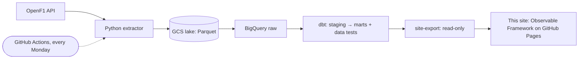

# pitwall — Plan 5: Lab site with the pitwall dashboard

> **For agentic workers:** REQUIRED SUB-SKILL: Use superpowers:subagent-driven-development (recommended) or superpowers:executing-plans to implement this plan task-by-task. Steps use checkbox (`- [ ]`) syntax for tracking.

**Goal:** A public lab portfolio site at `https://tomasripsky.github.io/data-engineering-lab/` — a landing page for every lab project plus pitwall's section (race strategy, tyre wear, undercut) — with a shared look that future projects reuse, rebuilt by pitwall's pipeline from prod data after every successful run.

**Architecture:** One Observable Framework project at the repo root, `site/`, owns GitHub Pages (one site per repo). Shared theme and components live in `site/src/components/`; each project gets `site/src/<project>/` with pages that follow one skeleton. Projects never query from the site: each exports its section's data with a tested command (`pitwall site-export --out site/src/pitwall/data`, read-only account in prod) and the site build only reads files. Today pitwall's pipeline exports → builds → deploys; a lab-level `lab-site` workflow that gathers several projects' exports is deferred until a second project needs the site (lab ADR 0005).

**Tech Stack:** Observable Framework 1.13.4 (Markdown + Observable Plot + Inputs), Node 22 in CI, Python export (google-cloud-bigquery, pyarrow), GitHub Pages via `actions/upload-pages-artifact` + `actions/deploy-pages`.

**Spec:** `docs/superpowers/specs/2026-09-29-pitwall-design.md` §8 — amended by pitwall ADR 0007 (Observable Framework instead of Evidence: Evidence's current BigQuery connector requires key files, blocked by the org policy and the keyless design) and lab ADR 0005 (one lab site, shared design, export contract).

## Global Constraints

- No keys: in prod the export authenticates through WIF as `pitwall-dashboard@pitwall-tr-prod` (read-only on `marts`); export queries only `{project}.marts.*`.
- **Page skeleton for every project page:** H1 phrased as the question the page answers → `<div class="tip">` **What am I looking at?** in plain English → charts built with the shared components → `<div class="note">` with limitations.
- Shared look: colours, fonts and number formats come from `site/src/components/lab.js` and `site/src/style.css`; project-specific encodings (tyre compounds) live in `site/src/<project>/components/`.
- Data sent to the browser: no 64-bit integers (Arrow JS turns them into `BigInt`), no timestamps (queries format dates as `YYYY-MM-DD`).
- Long-tailed durations (pit-lane time) are shown as **medians**, never means.
- Exported data files are build inputs, never committed (`site/src/*/data/` is git-ignored).
- Publishing happens only after the whole pitwall prod run succeeds (`needs: run`), with code from `main`.
- Actions pinned to commit SHAs; npm dependencies locked (`package-lock.json`, `npm ci`).
- Hard stops for Tomas: (1) enabling GitHub Pages / first public publish, (2) release v0.4.0.

## Review Focus

1. **Arrow `int64` reaches the browser as `BigInt`** and Plot/d3 silently mis-scale or throw → `browser_friendly` narrows to `int32`, overflow raises; unit tests in Task 1.
2. **An export query reading outside `marts` or writing** → a test inspects every query in `QUERIES`; Task 1.
3. **Races with imperfect data** (2023 stops inferred from tyre changes, invalid stint ranges, the Brazil 2025 red flag) must still render → checked in the browser in Task 3.
4. **A failed dbt test must not publish** → the `site` job needs `run` to succeed; verified in the job graph and the Task 7 run.
5. **Serving under `/data-engineering-lab/`** with project sections one level deeper → relative links; `dist/` served from that subpath locally in Task 3 before anything goes public.

---

### Task 1: `pitwall site-export`

**Files:**
- Create: `projects/pitwall/src/pitwall/site_data.py`
- Modify: `projects/pitwall/src/pitwall/cli.py`
- Test: `projects/pitwall/tests/test_site_data.py`, `projects/pitwall/tests/test_cli.py`

**Interfaces:**
- Produces:
  - `QUERIES: dict[str, str]` — keys `races`, `stints`, `pit_stops`, `tyre_wear`, `undercuts`; SQL with `{project}` placeholders
  - `query(sql, *, project=None, client=None) -> pa.Table`
  - `browser_friendly(table) -> pa.Table`
  - `export(out_dir: Path, *, project=None, client=None) -> dict[str, int]` — writes `<name>.parquet` per query, returns rows per file
  - CLI `pitwall site-export --out DIR` (needs `PITWALL_BQ_PROJECT`, not `PITWALL_LAKE_URI`)
- Files and columns (dates as strings, integers int32):
  - `races`: session_key, meeting_key, season, session_name, race_date, meeting_name, country_name, circuit_short_name
  - `stints`: session_key, season, circuit_short_name, driver_number, name_acronym, full_name, team_name, team_colour_hex, stint_number, compound, first_lap, last_lap, laps_in_stint, tyre_age_at_start, clean_laps, degradation_s_per_lap, finish_position, grid_position
  - `pit_stops`: session_key, driver_number, name_acronym, lap_number, pit_lane_time_s, stationary_time_s, source, compound_before, compound_after, position_before, position_after, neutralisation
  - `tyre_wear`: circuit_short_name, compound, tyre_age_laps, median_delta_s, laps
  - `undercuts`: session_key, season, session_name, meeting_name, circuit_short_name, attacker, attacker_team, defender, defender_team, attacker_pit_lap, defender_pit_lap, is_success, attacker_pitted_under_neutralisation

- [ ] **Step 1: Branch**

```bash
cd "/Users/tomasripsky/Data Engineering/Claude Code Enviroment"
git switch dev && git pull --ff-only
URL=$(gh issue create --title "feat(lab): portfolio site with the pitwall dashboard" \
  --label "type:feat,project:pitwall" \
  --body "Plan 5 of pitwall: docs/superpowers/plans/2026-09-30-pitwall-5-dashboard.md")
git switch -c "feat/${URL##*/}-lab-site-pitwall"
git add docs/superpowers/plans/2026-09-30-pitwall-5-dashboard.md
git commit -m "docs(pitwall): add implementation plan 5 (lab site + dashboard)"
```

- [ ] **Step 2: Failing tests**

`projects/pitwall/tests/test_site_data.py`:

```python
import re

import pyarrow as pa
import pyarrow.parquet as pq
import pytest

from pitwall.site_data import QUERIES, browser_friendly, export, query


class FakeClient:
    def __init__(self, table):
        self.table = table
        self.sql = []

    def query(self, sql):
        self.sql.append(sql)
        return self

    def to_arrow(self):
        return self.table


def test_query_fills_in_the_project():
    client = FakeClient(pa.table({"a": [1]}))
    query(
        "select 1 from `{project}.marts.dim_sessions`",
        project="pitwall-tr-dev",
        client=client,
    )
    assert client.sql == ["select 1 from `pitwall-tr-dev.marts.dim_sessions`"]


def test_browser_friendly_narrows_64_bit_integers():
    table = pa.table(
        {"lap": pa.array([1, 57], pa.int64()), "time": [90.1, 91.2], "name": ["A", "B"]}
    )
    friendly = browser_friendly(table)
    assert friendly.schema.field("lap").type == pa.int32()
    assert friendly.schema.field("time").type == pa.float64()
    assert friendly.column("lap").to_pylist() == [1, 57]


def test_browser_friendly_refuses_to_truncate():
    with pytest.raises(pa.ArrowInvalid):
        browser_friendly(pa.table({"big": pa.array([2**40], pa.int64())}))


def test_export_writes_one_browser_friendly_file_per_query(tmp_path):
    client = FakeClient(pa.table({"n": pa.array([7], pa.int64())}))
    rows = export(tmp_path / "data", project="p", client=client)
    assert rows == {name: 1 for name in QUERIES}
    for name in QUERIES:
        table = pq.read_table(tmp_path / "data" / f"{name}.parquet")
        assert table.schema.field("n").type == pa.int32()
    assert all("`p.marts." in sql for sql in client.sql)


def test_queries_only_read_marts():
    assert set(QUERIES) == {"races", "stints", "pit_stops", "tyre_wear", "undercuts"}
    for name, sql in QUERIES.items():
        tables = re.findall(r"`([^`]+)`", sql)
        assert tables and all(t.startswith("{project}.marts.") for t in tables), name
        assert not re.search(
            r"\b(insert|update|delete|merge|create|drop)\b", sql, re.I
        ), name
```

Append to `projects/pitwall/tests/test_cli.py`:

```python
def test_site_export_needs_a_bigquery_project_but_no_lake(monkeypatch, capsys):
    monkeypatch.delenv("PITWALL_LAKE_URI", raising=False)
    monkeypatch.delenv("PITWALL_BQ_PROJECT", raising=False)
    with pytest.raises(SystemExit) as exit_info:
        main(["site-export", "--out", "somewhere"])
    assert exit_info.value.code == 2
    assert "PITWALL_BQ_PROJECT" in capsys.readouterr().err


def test_site_export_writes_to_the_given_directory(monkeypatch, tmp_path):
    monkeypatch.delenv("PITWALL_LAKE_URI", raising=False)
    monkeypatch.setenv("PITWALL_BQ_PROJECT", "pitwall-tr-dev")
    calls = []
    monkeypatch.setattr(
        "pitwall.cli.export", lambda out, project: calls.append((out, project)) or {}
    )
    assert main(["site-export", "--out", str(tmp_path / "data")]) == 0
    assert calls == [(tmp_path / "data", "pitwall-tr-dev")]
```

Run: `cd projects/pitwall && uv run pytest tests/test_site_data.py tests/test_cli.py -q`
Expected: collection error `No module named 'pitwall.site_data'`.

- [ ] **Step 3: Implement `site_data.py`**

`projects/pitwall/src/pitwall/site_data.py`:

```python
"""Data for the lab site's pitwall section: query the marts, write browser-friendly Parquet.

The site never queries BigQuery itself: `pitwall site-export` writes these files into
`site/src/pitwall/data/` before the site is built (lab ADR 0005).
"""

from __future__ import annotations

import os
from pathlib import Path
from typing import Any

import pyarrow as pa
import pyarrow.parquet as pq

QUERIES: dict[str, str] = {
    "races": """
        select
            s.session_key,
            s.meeting_key,
            s.season,
            s.session_name,
            format_date('%Y-%m-%d', date(s.starts_at)) as race_date,
            m.meeting_name,
            m.country_name,
            m.circuit_short_name
        from `{project}.marts.dim_sessions` as s
        inner join `{project}.marts.dim_meetings` as m on m.meeting_key = s.meeting_key
        order by s.starts_at
    """,
    "stints": """
        select
            st.session_key,
            s.season,
            m.circuit_short_name,
            st.driver_number,
            d.name_acronym,
            d.full_name,
            d.team_name,
            d.team_colour_hex,
            st.stint_number,
            st.compound,
            st.first_lap,
            st.last_lap,
            st.laps_in_stint,
            st.tyre_age_at_start,
            st.clean_laps,
            st.degradation_s_per_lap,
            r.finish_position,
            r.grid_position
        from `{project}.marts.fct_stints` as st
        inner join `{project}.marts.dim_sessions` as s on s.session_key = st.session_key
        inner join `{project}.marts.dim_meetings` as m on m.meeting_key = s.meeting_key
        inner join `{project}.marts.dim_session_drivers` as d
            on d.session_key = st.session_key and d.driver_number = st.driver_number
        left join `{project}.marts.fct_session_results` as r
            on r.session_key = st.session_key and r.driver_number = st.driver_number
    """,
    "pit_stops": """
        select
            p.session_key,
            p.driver_number,
            d.name_acronym,
            p.lap_number,
            p.pit_lane_time_s,
            p.stationary_time_s,
            p.source,
            p.compound_before,
            p.compound_after,
            p.position_before,
            p.position_after,
            p.neutralisation
        from `{project}.marts.fct_pit_stops` as p
        inner join `{project}.marts.dim_session_drivers` as d
            on d.session_key = p.session_key and d.driver_number = p.driver_number
    """,
    # Each clean lap compared with its own stint's average: removes car and driver pace, leaving
    # the effect of tyre age (minus the fuel effect, explained on the site).
    "tyre_wear": """
        with clean as (
            select
                l.session_key,
                l.compound,
                l.tyre_age_laps,
                l.lap_time_s - avg(l.lap_time_s) over (
                    partition by l.session_key, l.driver_number, l.stint_number
                ) as delta_s
            from `{project}.marts.fct_laps` as l
            where l.is_clean_lap and l.compound in ('SOFT', 'MEDIUM', 'HARD')
        )

        select
            m.circuit_short_name,
            clean.compound,
            clean.tyre_age_laps,
            round(approx_quantiles(clean.delta_s, 2)[offset(1)], 3) as median_delta_s,
            count(*) as laps
        from clean
        inner join `{project}.marts.dim_sessions` as s on s.session_key = clean.session_key
        inner join `{project}.marts.dim_meetings` as m on m.meeting_key = s.meeting_key
        group by 1, 2, 3
        having count(*) >= 5
    """,
    "undercuts": """
        select
            u.session_key,
            s.season,
            s.session_name,
            m.meeting_name,
            m.circuit_short_name,
            a.name_acronym as attacker,
            a.team_name as attacker_team,
            d.name_acronym as defender,
            d.team_name as defender_team,
            u.attacker_pit_lap,
            u.defender_pit_lap,
            u.is_success,
            u.attacker_pitted_under_neutralisation
        from `{project}.marts.fct_undercut_attempts` as u
        inner join `{project}.marts.dim_sessions` as s on s.session_key = u.session_key
        inner join `{project}.marts.dim_meetings` as m on m.meeting_key = s.meeting_key
        inner join `{project}.marts.dim_session_drivers` as a
            on a.session_key = u.session_key and a.driver_number = u.attacker_driver_number
        inner join `{project}.marts.dim_session_drivers` as d
            on d.session_key = u.session_key and d.driver_number = u.defender_driver_number
    """,
}


def query(sql: str, *, project: str | None = None, client: Any = None) -> pa.Table:
    """Run `sql` (with `{project}` filled in) and return the result as an Arrow table."""
    project = project or os.environ["PITWALL_BQ_PROJECT"]
    if client is None:
        from google.cloud import bigquery

        client = bigquery.Client(project=project)
    return client.query(sql.format(project=project)).to_arrow()


def browser_friendly(table: pa.Table) -> pa.Table:
    """Narrow 64-bit integers to 32-bit: Arrow JS reads int64 as BigInt, which charts can't plot.

    The cast is safe: a value that doesn't fit raises instead of wrapping around.
    """
    fields = [
        pa.field(field.name, pa.int32()) if pa.types.is_int64(field.type) else field
        for field in table.schema
    ]
    return table.cast(pa.schema(fields))


def export(
    out_dir: Path, *, project: str | None = None, client: Any = None
) -> dict[str, int]:
    """Write one Parquet file per query into `out_dir`; return the rows written per file."""
    project = project or os.environ["PITWALL_BQ_PROJECT"]
    if client is None:
        from google.cloud import bigquery

        client = bigquery.Client(project=project)
    out_dir.mkdir(parents=True, exist_ok=True)
    written = {}
    for name, sql in QUERIES.items():
        table = browser_friendly(query(sql, project=project, client=client))
        pq.write_table(table, out_dir / f"{name}.parquet", compression="snappy")
        written[name] = table.num_rows
    return written
```

- [ ] **Step 4: CLI `site-export`**

In `projects/pitwall/src/pitwall/cli.py`:
- imports: add `from pathlib import Path` and `from pitwall.site_data import export`;
- after the `load` sub-parser add:

```python
site = commands.add_parser(
    "site-export", help="write the lab site's pitwall data files"
)
site.add_argument(
    "--out", required=True, help="directory to write the Parquet files into"
)
```

- right after `args = parser.parse_args(argv)` add (before any `PITWALL_LAKE_URI` check — the export doesn't touch the lake):

```python
if args.command == "site-export":
    project = os.environ.get("PITWALL_BQ_PROJECT")
    if not project:
        parser.error(
            "PITWALL_BQ_PROJECT is not set (the GCP project holding the marts)"
        )
    logging.basicConfig(
        level=logging.INFO, format="%(asctime)s %(levelname)s %(message)s"
    )
    written = export(Path(args.out), project=project)
    log.info("site data: %s", written)
    return 0
```

Run: `uv run pytest -q && uv run ruff check --fix . && uv run ruff format .`
Expected: 63 passed; ruff clean.

- [ ] **Step 5: Real export from dev**

Run: `PITWALL_BQ_PROJECT=pitwall-tr-dev uv run pitwall site-export --out "<session scratchpad>/site-data"` then `uv run python -c "import pyarrow.parquet as pq, pathlib, sys; [print(p.name, pq.read_table(p).num_rows, [str(f.type) for f in pq.read_schema(p) if 'int64' in str(f.type) or 'timestamp' in str(f.type)]) for p in sorted(pathlib.Path(sys.argv[1]).glob('*.parquet'))]" "<session scratchpad>/site-data"`
Expected: five files with rows (races ≈ 108, stints ≈ 5,500, pit_stops ≈ 3,300, tyre_wear ≈ 2,000, undercuts ≈ 800), each with an empty list of int64/timestamp columns.

- [ ] **Step 6: Commit**

```bash
git add src/pitwall/site_data.py src/pitwall/cli.py tests/test_site_data.py tests/test_cli.py
git commit -m "feat(pitwall): add site-export for the lab site's pitwall section"
```

---

### Task 2: Lab site skeleton and shared design

**Files:**
- Create: `site/package.json`, `site/package-lock.json` (generated), `site/observablehq.config.js`, `site/src/style.css`, `site/src/components/lab.js`, `site/src/index.md`, `site/README.md`
- Modify: root `.gitignore`, `projects/pitwall/Makefile`

**Interfaces:**
- Produces: `rows(table)`, `palette`, `fmt` from `site/src/components/lab.js`; `make site`, `make site-data`, `make site-preview` in `projects/pitwall`.

- [ ] **Step 1: `site/package.json`**

```json
{
  "type": "module",
  "private": true,
  "scripts": {
    "build": "observable build",
    "dev": "observable preview",
    "clean": "rm -rf src/.observablehq/cache dist"
  },
  "dependencies": {
    "@observablehq/framework": "1.13.4"
  },
  "engines": {
    "node": ">=18"
  }
}
```

Run: `cd site && npm install`
Expected: `package-lock.json` created.

- [ ] **Step 2: `site/observablehq.config.js`**

```js
// Lab portfolio site — one GitHub Pages site for every lab project (lab ADR 0005).
export default {
  title: "Data Engineering Lab",
  root: "src",
  base: "/data-engineering-lab/",
  style: "style.css",
  pages: [
    {
      name: "pitwall — F1 race strategy",
      path: "/pitwall/",
      pages: [
        {name: "Race strategy", path: "/pitwall/race-strategy"},
        {name: "Tyre wear", path: "/pitwall/tyre-wear"},
        {name: "The undercut", path: "/pitwall/undercut"},
        {name: "About the data", path: "/pitwall/about"}
      ]
    }
  ],
  footer:
    'Data Engineering Lab by Tomas Ripsky · <a href="https://github.com/TomasRipsky/data-engineering-lab">source on GitHub</a>'
};
```

- [ ] **Step 3: Shared theme and components**

`site/src/style.css`:

```css
/* Lab theme: Framework's default look with one accent colour shared by every project. */
@import url("observablehq:default.css");
@import url("observablehq:theme-air.css");

:root {
  --lab-accent: #2a9d8f;
  --lab-ink: #264653;
  --theme-foreground-focus: var(--lab-accent);
}

.big {
  font-size: 2rem;
  font-weight: 700;
  color: var(--lab-ink);
}
```

`site/src/components/lab.js`:

```js
// Shared building blocks for every project section. Project-specific encodings (e.g. tyre
// compounds) belong in site/src/<project>/components/.
import * as d3 from "npm:d3";

/** Lab colours: `accent` for the main series, `ink` for secondary ones. */
export const palette = {accent: "#2a9d8f", ink: "#264653", muted: "#8f8f8f"};

/** Arrow table → array of plain objects. */
export function rows(table) {
  return Array.from(table, (row) => row.toJSON());
}

/** Number formats used across the site. */
export const fmt = {
  count: d3.format(","),
  seconds: (s) => `${d3.format(".1f")(s)} s`,
  percent: d3.format(".0%")
};
```

- [ ] **Step 4: Landing page `site/src/index.md`**

```md
---
title: Data Engineering Lab
toc: false
---

# Data Engineering Lab

Projects built end to end — ingestion, cloud infrastructure, modelling, tests, CI/CD and a public
page like this one — to learn the craft in the open. Each project explains itself to readers who
don't know its domain.

<div class="grid grid-cols-2">
  <a class="card" href="./pitwall/" style="text-decoration: none;">
    <h2>pitwall — F1 race strategy</h2>
    <p>How Formula 1 races are won with tyres and pit stops, from every race since 2023.</p>
    <p><small>OpenF1 · Python · GCS · BigQuery · dbt · GitHub Actions · Observable</small></p>
  </a>
</div>
```

- [ ] **Step 5: The contract — `site/README.md`**

```markdown
# Lab site

One GitHub Pages site for the whole lab: https://tomasripsky.github.io/data-engineering-lab/
(lab ADR 0005). Built with Observable Framework.

## Adding a project section

1. **Pages** go in `src/<project>/` (`index.md` + one page per question). Add the section to
   `observablehq.config.js` and a card to `src/index.md`.
2. **Data** is exported by the project, never queried from the site: a tested project command
   writes files into `src/<project>/data/` (git-ignored) before the build — e.g.
   `pitwall site-export --out site/src/pitwall/data`. Use a read-only identity and export only
   data you are happy to publish.
3. **Look**: use `src/components/lab.js` (palette, `rows`, `fmt`) and the theme in `src/style.css`.
   Domain encodings (e.g. tyre colours) live in `src/<project>/components/`.
4. **Page skeleton** (every page):
   - H1 phrased as the question the page answers;
   - `<div class="tip">` starting with **What am I looking at?** in plain language;
   - the charts;
   - `<div class="note">` with the limitations.
5. **Browser-friendly data**: no 64-bit integers (they arrive as `BigInt`) and no timestamps
   (format dates as strings); show medians for long-tailed durations.

## Build and publish

Today pitwall's pipeline exports its data, builds the site and deploys it (`make site` in
`projects/pitwall`). When a second project needs the site, a lab-level `lab-site` workflow will
collect every project's export and build once (see lab ADR 0005).
```

- [ ] **Step 6: Ignores and make targets**

Append to the root `.gitignore`:

```
# Lab site (Observable Framework)
site/node_modules/
site/dist/
site/src/.observablehq/cache/
# exported by each project before the build; never committed
site/src/*/data/
```

In `projects/pitwall/Makefile` add `site-data site site-preview` to `.PHONY` and, after `transform`:

```make
SITE_DIR := ../../site

site-data: ## Export pitwall's section data from $(PROJECT_ID) marts into the lab site
	uv run pitwall site-export --out $(SITE_DIR)/src/pitwall/data

site: site-data ## Build the whole lab site into site/dist
	cd $(SITE_DIR) && npm ci --silent && npm run build

site-preview: site-data ## Live-reloading lab site on http://127.0.0.1:3000
	cd $(SITE_DIR) && npm ci --silent && npm run dev
```

- [ ] **Step 7: Build the skeleton**

Run: `cd projects/pitwall && make site`
Expected: export logs five files; Framework builds `site/dist/index.html` (pitwall pages don't exist yet, so the sidebar links 404 until Task 3 — acceptable at this step).

- [ ] **Step 8: Commit**

```bash
cd "/Users/tomasripsky/Data Engineering/Claude Code Enviroment"
git add site/package.json site/package-lock.json site/observablehq.config.js site/src/style.css \
  site/src/components site/src/index.md site/README.md .gitignore projects/pitwall/Makefile
git commit -m "feat(lab): add the lab site skeleton with a shared theme and section contract"
```

---

### Task 3: pitwall section

**Files:**
- Create: `site/src/pitwall/components/f1.js`, `site/src/pitwall/index.md`, `race-strategy.md`, `tyre-wear.md`, `undercut.md`, `about.md`

- [ ] **Step 1: `site/src/pitwall/components/f1.js`**

```js
// pitwall-specific encodings.

/** Tyre colours as shown on F1 broadcasts (HARD darkened so it shows on a white page). */
export const compoundColor = {
  domain: ["SOFT", "MEDIUM", "HARD", "INTERMEDIATE", "WET", "UNKNOWN"],
  range: ["#da291c", "#ffd12e", "#8f8f8f", "#43b02a", "#0067ad", "#cccccc"]
};
```

- [ ] **Step 2: `site/src/pitwall/index.md`**

````md
---
title: pitwall — F1 race strategy
toc: false
---

```js
import {rows, fmt} from "../components/lab.js";
const races = rows(await FileAttachment("data/races.parquet").parquet());
const stops = rows(await FileAttachment("data/pit_stops.parquet").parquet());
const latest = races.at(-1);
```

# How are Formula 1 races won with tyres and pit stops?

<div class="tip">

**What am I looking at?** A data pipeline that downloads every Formula 1 race since 2023 from [OpenF1](https://openf1.org), models it in BigQuery with dbt, and turns it into a few questions anyone can follow — even if you have never watched a race. It refreshes itself every Monday after a Grand Prix.

</div>

<div class="grid grid-cols-4">
  <div class="card"><h2>Races analysed</h2><span class="big">${races.length}</span></div>
  <div class="card"><h2>Seasons</h2><span class="big">${d3.min(races, (d) => d.season)}–${d3.max(races, (d) => d.season)}</span></div>
  <div class="card"><h2>Pit stops</h2><span class="big">${fmt.count(stops.length)}</span></div>
  <div class="card"><h2>Median time in the pit lane</h2><span class="big">${fmt.seconds(d3.median(stops.filter((d) => d.source === "pit"), (d) => d.pit_lane_time_s))}</span></div>
</div>

Latest race included: **${latest.meeting_name}** (${latest.session_name}, ${latest.race_date}).

## F1 in one minute

| Term | Meaning |
|---|---|
| **Grand Prix** | One race weekend at one circuit. |
| **Race / Sprint** | Sunday's full-distance race / Saturday's short race. Both are analysed here. |
| **Compound** | Tyre type: <span style="color:#da291c">■</span> SOFT (fast, wears quickly), <span style="color:#ffd12e">■</span> MEDIUM, <span style="color:#8f8f8f">■</span> HARD (slow, lasts), <span style="color:#43b02a">■</span> INTERMEDIATE and <span style="color:#0067ad">■</span> WET (rain). |
| **Stint** | The laps a driver does on one set of tyres, between two pit stops. |
| **Pit stop** | Stop to change tyres: about 2–3 s stationary, about 20 s lost overall. |
| **Undercut** | Pitting before the car just ahead, so fresh tyres put you in front once they pit too. |
| **Safety Car** | Everyone slows down after an incident, which makes pitting cheaper. |

## Questions

- [**Race strategy**](./race-strategy) — who ran which tyres, and when everyone stopped, in any race.
- [**Tyre wear**](./tyre-wear) — how quickly each tyre gets slower, circuit by circuit.
- [**The undercut**](./undercut) — does pitting first actually work?
- [**About the data**](./about) — how the pipeline works and what the data can and can't say.
````

- [ ] **Step 3: `site/src/pitwall/race-strategy.md`**

````md
---
title: Race strategy
---

```js
import {rows} from "../components/lab.js";
import {compoundColor} from "./components/f1.js";
const races = rows(await FileAttachment("data/races.parquet").parquet());
const stints = rows(await FileAttachment("data/stints.parquet").parquet());
const stops = rows(await FileAttachment("data/pit_stops.parquet").parquet());
```

# Who ran which tyres, and when did everyone stop?

<div class="tip">

**What am I looking at?** Each row is a driver, in finishing order. Each coloured bar is a **stint** — the laps driven on one set of tyres — coloured by tyre type. The black diamonds are **pit stops**. Reading across a row tells you that driver's strategy; comparing rows shows who stopped earlier or later, and on which tyres.

</div>

```js
const season = view(Inputs.select(d3.sort(new Set(races.map((d) => d.season)), (d) => -d), {label: "Season"}));
```

```js
const race = view(
  Inputs.select(races.filter((d) => d.season === season).reverse(), {
    label: "Race",
    format: (d) => `${d.meeting_name} · ${d.session_name}`
  })
);
```

```js
const raceStints = stints.filter((d) => d.session_key === race.session_key);
const raceStops = stops.filter((d) => d.session_key === race.session_key);
const finish = new Map(raceStints.map((d) => [d.name_acronym, d.finish_position ?? 99]));
const order = d3.sort(finish.keys(), (a) => finish.get(a));
```

```js
display(
  Plot.plot({
    title: `${race.meeting_name} ${race.season} · ${race.session_name}`,
    width,
    height: 26 * order.length + 80,
    marginLeft: 50,
    x: {label: "Lap →", grid: true},
    y: {domain: order, label: null},
    color: {...compoundColor, legend: true},
    marks: [
      Plot.barX(raceStints, {
        x1: (d) => d.first_lap - 1,
        x2: "last_lap",
        y: "name_acronym",
        fill: "compound",
        inset: 1,
        channels: {Driver: "full_name", Team: "team_name", Stint: "stint_number", "Wear (s/lap)": "degradation_s_per_lap"},
        tip: true
      }),
      Plot.dot(raceStops, {
        x: "lap_number",
        y: "name_acronym",
        symbol: "diamond",
        fill: "black",
        r: 4,
        channels: {"Pit lane (s)": "pit_lane_time_s", "Under": "neutralisation"},
        tip: true
      })
    ]
  })
);
```

```js
const results = d3
  .sort(new Map(raceStints.map((d) => [d.driver_number, d])).values(), (d) => d.finish_position ?? 99)
  .map((d) => ({
    Finish: d.finish_position ?? "—",
    Driver: d.full_name,
    Team: d.team_name,
    Grid: d.grid_position ?? "pit lane",
    Stops: raceStops.filter((s) => s.driver_number === d.driver_number).length
  }));
display(Inputs.table(results, {select: false, rows: 25}));
```

<div class="note">

A stop marked "SC", "VSC" or "RED" happened under the Safety Car, the Virtual Safety Car or a red flag, when stopping costs less time. Some 2023 races have no official pit data: their stops are inferred from tyre changes and have no timing.

</div>
````

- [ ] **Step 4: `site/src/pitwall/tyre-wear.md`**

````md
---
title: Tyre wear
---

```js
import {rows} from "../components/lab.js";
import {compoundColor} from "./components/f1.js";
const wear = rows(await FileAttachment("data/tyre_wear.parquet").parquet());
const stints = rows(await FileAttachment("data/stints.parquet").parquet());
```

# How quickly does each tyre get slower?

<div class="tip">

**What am I looking at?** As a tyre wears out, each lap gets slower. For every clean lap (no pit stop, no Safety Car) we compare its time with the average of the same driver's stint, then take the median across all drivers and seasons at that circuit. A line that climbs steeply means that tyre loses grip quickly there. Soft tyres usually climb fastest.

</div>

```js
const circuits = d3.sort(new Set(wear.map((d) => d.circuit_short_name)));
const circuit = view(Inputs.select(circuits, {label: "Circuit", value: circuits.includes("Monza") ? "Monza" : circuits[0]}));
```

```js
const circuitWear = wear.filter((d) => d.circuit_short_name === circuit);
display(
  Plot.plot({
    title: `${circuit}: lap time vs tyre age`,
    width,
    height: 380,
    x: {label: "Tyre age (laps) →"},
    y: {label: "↑ Slower than the stint average (s)", grid: true},
    color: {...compoundColor, legend: true},
    marks: [
      Plot.ruleY([0]),
      Plot.line(circuitWear, {x: "tyre_age_laps", y: "median_delta_s", stroke: "compound", curve: "monotone-x"}),
      Plot.dot(circuitWear, {x: "tyre_age_laps", y: "median_delta_s", fill: "compound", r: 3, channels: {Laps: "laps"}, tip: true})
    ]
  })
);
```

```js
const wearByCompound = d3
  .rollups(
    stints.filter((d) => d.circuit_short_name === circuit && d.degradation_s_per_lap !== null),
    (v) => ({stints: v.length, median: d3.median(v, (d) => d.degradation_s_per_lap)}),
    (d) => d.compound
  )
  .map(([compound, s]) => ({Tyre: compound, "Seconds lost per lap (median)": s.median.toFixed(3), Stints: s.stints}));
display(Inputs.table(wearByCompound, {select: false}));
```

<div class="note">

Cars also get lighter as fuel burns (roughly 0.03–0.06 s faster per lap), which hides part of the wear — so real wear is a little higher than shown, and very durable tyres can even look like they get *faster*.

</div>
````

- [ ] **Step 5: `site/src/pitwall/undercut.md`**

````md
---
title: The undercut
---

```js
import {rows, palette} from "../components/lab.js";
const attempts = rows(await FileAttachment("data/undercuts.parquet").parquet())
  .filter((d) => d.is_success !== null)
  .map((d) => ({...d, success: d.is_success ? 1 : 0}));
```

# Does pitting first work?

<div class="tip">

**What am I looking at?** The **undercut**: a driver stuck right behind a rival pits first. Fresh tyres are faster, so by the time the rival pits too, the driver may come out in front. We count an attempt when the car directly ahead pits within the next 3 laps, and a **success** when the attacker is ahead once both have stopped.

</div>

```js
const greenOnly = view(Inputs.toggle({label: "Only stops under green flag", value: true}));
```

```js
const shown = attempts.filter((d) => !greenOnly || !d.attacker_pitted_under_neutralisation);
const bySeason = d3
  .rollups(shown, (v) => ({rate: d3.mean(v, (d) => d.success), n: v.length}), (d) => d.season)
  .map(([season, s]) => ({season: String(season), ...s}));
const byTeam = d3
  .rollups(shown, (v) => ({rate: d3.mean(v, (d) => d.success), n: v.length}), (d) => d.attacker_team)
  .map(([team, s]) => ({team, ...s}))
  .filter((d) => d.n >= 8);
```

<div class="grid grid-cols-2">
<div class="card">

```js
display(Plot.plot({
  title: "Success rate by season",
  y: {label: "↑ Successful attempts (%)", percent: true, domain: [0, 100], grid: true},
  x: {label: null},
  marks: [
    Plot.barY(bySeason, {x: "season", y: "rate", fill: palette.accent, channels: {Attempts: "n"}, tip: true}),
    Plot.ruleY([0])
  ]
}));
```

</div>
<div class="card">

```js
display(Plot.plot({
  title: "Success rate by team (8+ attempts)",
  marginLeft: 120,
  x: {label: "Successful attempts (%) →", percent: true, domain: [0, 100], grid: true},
  y: {label: null},
  marks: [
    Plot.barX(byTeam, {y: "team", x: "rate", sort: {y: "-x"}, fill: palette.ink, channels: {Attempts: "n"}, tip: true}),
    Plot.ruleX([0])
  ]
}));
```

</div>
</div>

```js
display(Inputs.table(
  shown.map((d) => ({
    Season: d.season,
    Race: `${d.meeting_name} · ${d.session_name}`,
    Attacker: `${d.attacker} (${d.attacker_team})`,
    Defender: `${d.defender} (${d.defender_team})`,
    "Pitted on lap": d.attacker_pit_lap,
    "Rival pitted on lap": d.defender_pit_lap,
    Worked: d.is_success ? "yes" : "no"
  })),
  {select: false, rows: 15}
));
```

<div class="note">

**Limitations.** Only positions are used, not the time gaps between cars, and the rival may have had reasons of their own to pit. Stops during a red flag (free tyre changes) are excluded; stops under a Safety Car are hidden by the toggle above.

</div>
````

- [ ] **Step 6: `site/src/pitwall/about.md`**

````md
---
title: About the data
---

```js
import {rows} from "../components/lab.js";
const races = rows(await FileAttachment("data/races.parquet").parquet());
const latest = races.at(-1);
```

# Where do these numbers come from?

<div class="tip">

**What am I looking at?** How this section is built, where the numbers come from, and what they can't tell you. Latest race included: **${latest.meeting_name} ${latest.season}** (${latest.race_date}).

</div>



- **Source:** [OpenF1](https://openf1.org), an unofficial open API of Formula 1 timing data, from 2023 onwards. Race and Sprint sessions only.
- **Pipeline:** a Python extractor stores every Grand Prix in a Google Cloud Storage lake, then BigQuery and dbt turn it into tested tables. GitHub Actions runs it every Monday and rebuilds this site, with no stored passwords or keys (Workload Identity Federation). The site itself only receives files exported by a read-only account.
- **Quality:** impossible values stop the pipeline, so this site keeps the last good version. Unusual-but-real data (red-flag stops, wet races, a few broken tyre records) is kept, flagged and explained.
- **Definitions:** a *clean lap* excludes the first lap, laps entering or leaving the pits, Safety Car laps and anything slower than 1.2 × the race's median lap. Tyre wear is the trend of clean laps against tyre age. The undercut rules are on [its page](./undercut).
- **Code, tests and design decisions:** [github.com/TomasRipsky/data-engineering-lab](https://github.com/TomasRipsky/data-engineering-lab/tree/main/projects/pitwall).

<div class="note">

OpenF1 is unofficial and not affiliated with Formula 1. Its data can have gaps (for example missing pit timings in some 2023 races); the pipeline documents and works around them rather than hiding them.

</div>
````

- [ ] **Step 7: Build and look at it under the real subpath**

```bash
cd "/Users/tomasripsky/Data Engineering/Claude Code Enviroment/projects/pitwall" && make site
SITE=/private/tmp/claude-501/-Users-tomasripsky-Data-Engineering-Claude-Code-Enviroment/8b75d4ae-fb45-4d41-a795-451ac0cdaa66/scratchpad/site
rm -rf "$SITE" && mkdir -p "$SITE" && cp -R ../../site/dist "$SITE/data-engineering-lab" && du -sh ../../site/dist
```

Expected: build succeeds; `dist` well under 20 MB. Add to `.claude/launch.json` a configuration `lab-site-dist` running `python3 -m http.server 8765 --directory <SITE>` on port 8765, open `http://localhost:8765/data-engineering-lab/` in the built-in browser and check, with no console errors (`read_console_messages`):
- Landing: pitwall card links to the section.
- pitwall home: four cards with numbers and the latest race.
- Race strategy: Brazil 2025 Sprint (red flag) and Bahrain 2023 Race (inferred stops) show bars, diamonds and the table.
- Tyre wear: Monza shows three lines; the table lists SOFT/MEDIUM/HARD.
- Undercut: two charts and the table; the toggle changes the numbers.
- About: mermaid renders.
Fix any issue and recheck. Stop the preview server afterwards.

- [ ] **Step 8: Commit**

```bash
cd "/Users/tomasripsky/Data Engineering/Claude Code Enviroment"
git add site/src/pitwall
git commit -m "feat(pitwall): add the pitwall section of the lab site"
```

---

### Task 4: CI builds the site

**Files:**
- Modify: `.github/workflows/pitwall-ci.yml`, `.github/dependabot.yml`

- [ ] **Step 1: Resolve SHAs for the new actions**

```bash
for rt in actions/setup-node:v7.0.0 actions/upload-pages-artifact:v5.0.0 actions/deploy-pages:v5.0.1; do
  r=${rt%%:*}; t=${rt##*:}; o=$(gh api repos/$r/git/ref/tags/$t -q '.object.type + " " + .object.sha')
  typ=${o%% *}; sha=${o##* }; [ "$typ" = "tag" ] && sha=$(gh api repos/$r/git/tags/$sha -q .object.sha)
  echo "$r@$sha # $t"
done
```

Expected: three `owner/action@<40-hex> # vX.Y.Z` lines; use them in this task and Task 5.

- [ ] **Step 2: CI triggers and `site` job**

In `pitwall-ci.yml` add `"site/**"` to the `pull_request.paths` list, and append under `jobs:`:

```yaml
  site:
    if: >-
      github.event_name == 'workflow_dispatch' ||
      (github.event.pull_request.head.repo.full_name == github.repository && github.actor != 'dependabot[bot]')
    runs-on: ubuntu-latest
    timeout-minutes: 30
    environment: dev
    permissions:
      contents: read
      id-token: write
    steps:
      - uses: actions/checkout@3d3c42e5aac5ba805825da76410c181273ba90b1 # v7.0.1
      - uses: google-github-actions/auth@7c6bc770dae815cd3e89ee6cdf493a5fab2cc093 # v3.0.0
        with:
          workload_identity_provider: ${{ vars.PITWALL_WIF_PROVIDER }}
          service_account: ${{ vars.PITWALL_SERVICE_ACCOUNT }}
      - uses: astral-sh/setup-uv@c18668ad3cf93ea998bef934396af7bb5c839dc7 # v10.2.0
      - run: uv sync --locked
      - uses: actions/setup-node@<sha from Step 1> # v7.0.0
        with:
          node-version: 22
          cache: npm
          cache-dependency-path: site/package-lock.json
      - name: Export dev data and build the lab site
        run: make site
```

(`defaults.run.working-directory: projects/pitwall` already applies; the Makefile exports `PITWALL_BQ_PROJECT` for `ENV=dev`.)

- [ ] **Step 3: Dependabot for the site's npm dependencies**

Append to `.github/dependabot.yml`:

```yaml
  - package-ecosystem: npm
    directory: /site
    schedule:
      interval: monthly
```

- [ ] **Step 4: Commit**

```bash
git add .github/workflows/pitwall-ci.yml .github/dependabot.yml
git commit -m "ci(pitwall): build the lab site in CI against dev data"
```

---

### Task 5: Publish from the pipeline

**Files:**
- Modify: `.github/workflows/pitwall-pipeline.yml`, `projects/pitwall/Makefile`

- [ ] **Step 1: Triggers, modes and publish jobs**

In `pitwall-pipeline.yml`:
- add to `on:`:

```yaml
  push:
    branches: [main]
    paths: ["projects/pitwall/**", "site/**"]
```

- replace every `github.event_name == 'schedule' && 'prod' || inputs.env` with `github.event_name == 'workflow_dispatch' && inputs.env || 'prod'` (concurrency group, `environment`, `TARGET_ENV`);
- set `MODE` to `${{ github.event_name == 'workflow_dispatch' && inputs.mode || (github.event_name == 'schedule' && 'latest' || 'none') }}` (a release push reloads, rebuilds and republishes without calling the API);
- append:

```yaml
  site:
    needs: run
    # prod only, and only after ingest → load → transform (incl. every dbt test) succeeded
    if: needs.run.result == 'success' && (github.event_name != 'workflow_dispatch' || inputs.env == 'prod')
    runs-on: ubuntu-latest
    timeout-minutes: 30
    environment: prod
    permissions:
      contents: read
      id-token: write
    defaults:
      run:
        working-directory: projects/pitwall
    steps:
      - uses: actions/checkout@3d3c42e5aac5ba805825da76410c181273ba90b1 # v7.0.1
        with:
          ref: main
      - uses: google-github-actions/auth@7c6bc770dae815cd3e89ee6cdf493a5fab2cc093 # v3.0.0
        with:
          workload_identity_provider: ${{ vars.PITWALL_WIF_PROVIDER }}
          # read-only on marts: the site build can never change data
          service_account: ${{ vars.PITWALL_DASHBOARD_SERVICE_ACCOUNT }}
      - uses: astral-sh/setup-uv@c18668ad3cf93ea998bef934396af7bb5c839dc7 # v10.2.0
      - run: uv sync --locked
      - uses: actions/setup-node@<sha from Task 4> # v7.0.0
        with:
          node-version: 22
          cache: npm
          cache-dependency-path: site/package-lock.json
      - run: make site ENV=prod
      - uses: actions/upload-pages-artifact@<sha from Task 4> # v5.0.0
        with:
          path: site/dist

  deploy:
    needs: site
    runs-on: ubuntu-latest
    environment:
      name: github-pages
      url: ${{ steps.deployment.outputs.page_url }}
    permissions:
      pages: write
      id-token: write
    steps:
      - id: deployment
        uses: actions/deploy-pages@<sha from Task 4> # v5.0.1
```

Validate: `uv run -q --no-project --with pyyaml python -c "import yaml; d=yaml.safe_load(open('.github/workflows/pitwall-pipeline.yml')); print(list(d[True]), list(d['jobs']), d['jobs']['site']['needs'], d['jobs']['deploy']['needs'])"`
Expected: `['schedule', 'workflow_dispatch', 'push'] ['run', 'site', 'deploy'] run site`.

- [ ] **Step 2: Publish the dashboard account to the prod GitHub environment**

Append to the Makefile `gh-vars` recipe:

```make
	if [ "$(ENV)" = "prod" ]; then gh variable set PITWALL_DASHBOARD_SERVICE_ACCOUNT --env prod --body "$$($(TF) output -raw dashboard_service_account)"; fi
```

Run: `cd projects/pitwall && make gh-vars ENV=prod && gh variable list --env prod`
Expected: four variables including `PITWALL_DASHBOARD_SERVICE_ACCOUNT`.

- [ ] **Step 3: Commit**

```bash
git add .github/workflows/pitwall-pipeline.yml projects/pitwall/Makefile
git commit -m "ci(pitwall): publish the lab site to GitHub Pages after successful prod runs"
```

---

### Task 6: PR, review, merge

- [ ] **Step 1:** push, open the PR into `dev` (`Closes #<issue>`), watch `pitwall-ci` (python, terraform, dbt, **site**) to green.
- [ ] **Step 2:** run the `pr-reviewer` agent with this plan's Review Focus; fix Critical/Important findings (test first for Python/SQL; reproduce page issues in the browser first).
- [ ] **Step 3:** wait until `gh pr view --json closingIssuesReferences` lists the issue, squash-merge, confirm the issue is closed.

---

### Task 7: Go public

- [ ] **Step 1: HARD STOP — confirm with Tomas**

"About to (1) enable GitHub Pages for the repo (source: GitHub Actions) — https://tomasripsky.github.io/data-engineering-lab/ becomes public, showing the lab landing page and pitwall's OpenF1-derived race data with links to the repo; (2) release v0.4.0 to `main`, whose push triggers the pipeline (`mode=none`: reload, rebuild models, export, build and deploy the site from prod). Cost: 0. Proceed?"

- [ ] **Step 2: Enable Pages and allow deploys from `dev` and `main`**

```bash
REPO=TomasRipsky/data-engineering-lab
gh api -X POST "repos/$REPO/pages" -f build_type=workflow >/dev/null
gh api -X PUT "repos/$REPO/environments/github-pages" --input - >/dev/null <<'EOF'
{"deployment_branch_policy": {"protected_branches": false, "custom_branch_policies": true}}
EOF
for b in dev main; do gh api -X POST "repos/$REPO/environments/github-pages/deployment-branch-policies" -f name="$b" -f type=branch >/dev/null; done
gh api "repos/$REPO/pages" -q '.build_type + " " + .html_url'
```

Expected: `workflow https://tomasripsky.github.io/data-engineering-lab/`.

- [ ] **Step 3: Release v0.4.0** (lab recipe; check `closingIssuesReferences` before each merge): CHANGELOG `[Unreleased]` → `[0.4.0] - <today>` via a `chore/<issue>-release-v0.4.0` PR into `dev`; PR `dev → main` titled `release: v0.4.0`, merge commit; `gh release create v0.4.0 --target main --title "v0.4.0 — lab site and pitwall dashboard" --notes "<CHANGELOG 0.4.0 section>"`.

- [ ] **Step 4: Watch the publish**

The push to `main` starts `pitwall-pipeline` (mode `none`): `run` → `site` → `deploy` all succeed; the deploy job prints the page URL. Then `curl -sI https://tomasripsky.github.io/data-engineering-lab/pitwall/ | head -1` → `HTTP/2 200`, and open the site in the built-in browser to check every page as in Task 3 Step 7 (now prod data, real URL).

---

### Task 8: Decisions, docs, knowledge

**Files:**
- Create: `docs/adr/0005-one-lab-site-with-a-shared-design.md`, `projects/pitwall/docs/decisions/0007-observable-framework-for-the-dashboard.md`
- Modify: `CLAUDE.md`, root `README.md`, `projects/pitwall/README.md`, `CHANGELOG.md`, `docs/superpowers/specs/2026-09-29-pitwall-design.md`

- [ ] **Step 1: Lab ADR 0005**

```markdown
# 0005 — One lab site with a shared design

- **Status:** Accepted
- **Date:** 2026-09-30

## Context
The lab is one repository with many projects, and GitHub Pages serves one site per repository.
Tomas wants every project's visualizations to look alike.

## Decision
A single Observable Framework site in `site/` is the lab's portfolio: a landing page plus one
section per project. Shared theme and components (`site/src/components/`, `site/src/style.css`)
and a fixed page skeleton ("What am I looking at?" → charts → limitations) keep projects
consistent. Projects hand the site **exported data files** (a tested per-project command writing
to `site/src/<project>/data/`), never live queries, so the site needs no knowledge of any
project's cloud or credentials.

## Alternatives considered
- One Pages site per project — impossible within one repo.
- A repository per project's site — scatters the portfolio and duplicates the design.
- Live queries from the site build — couples the site to every project's cloud and credentials.

## Consequences
- Today pitwall's pipeline exports, builds and deploys the whole site. When a second project needs
  the site, a lab-level `lab-site` workflow will gather every project's export and build once — a
  change of where files meet, not of the contract.
- Every deploy replaces the whole site, so until that workflow exists only pitwall may deploy.
```

- [ ] **Step 2: pitwall ADR 0007**

```markdown
# 0007 — Observable Framework for the dashboard (instead of Evidence)

- **Status:** Accepted (supersedes the spec's choice of Evidence)
- **Date:** 2026-09-30

## Context
The spec chose Evidence (BI-as-code) on GitHub Pages. Evidence's current line connects to BigQuery
**only with a service-account key file**; the organization forbids key creation
(`iam.disableServiceAccountKeyCreation`) and the project is keyless by design (WIF). The classic
Evidence line (40.x), whose connector supported ADC, has had no release since February 2026 while
the repository moved to the new product.

## Decision
Observable Framework, as the lab site (lab ADR 0005). pitwall's pages read Parquet files written by
`pitwall site-export`, which runs as the read-only dashboard account in prod.

## Alternatives considered
- Evidence (current) with a key — needs an org-policy exception and a long-lived secret.
- Evidence classic 40.x with `gcloud-cli` auth — works, but builds on a line its vendor abandoned.
- Looker Studio / Streamlit — rejected earlier (click-ops; runtime credentials and cold starts).

## Consequences
- Charts are ~20 lines of JavaScript each instead of prebuilt components: more control (the stint
  timeline), a little more code.
- The published site is fully static and keeps working even if the tool stops evolving; only
  rebuilds depend on it.
```

- [ ] **Step 3: CLAUDE.md, READMEs, CHANGELOG, spec**

- `CLAUDE.md` → Repo map, add: `- \`site/\` — the lab's single public site (GitHub Pages). A project with a visual layer adds a section per \`site/README.md\` (shared design, exported data only — ADR 0005).`
- Root `README.md`: under the intro add `**Live site:** https://tomasripsky.github.io/data-engineering-lab/`; pitwall row → Stack `Python · GCS · BigQuery · dbt · GitHub Actions · Observable`, Status `✅ live — [dashboard](https://tomasripsky.github.io/data-engineering-lab/pitwall/)`.
- `projects/pitwall/README.md`: under the pitch `**Live dashboard:** https://tomasripsky.github.io/data-engineering-lab/pitwall/`; mermaid `-. Plan 4 .-> site[Evidence on GitHub Pages]` → `--> export[site-export] --> site[Lab site on GitHub Pages]`; Tech stack row `Dashboard | Observable Framework (lab site) | Static, keyless, shared design — [ADR 0007](docs/decisions/0007-observable-framework-for-the-dashboard.md)`; "Run it" gains `make site-preview   # lab site with dev data on http://127.0.0.1:3000`.
- `CHANGELOG.md` `[Unreleased]` → `### Added`: `- Lab site (\`site/\`, Observable Framework on GitHub Pages) with a shared design and a per-project data export contract; \`pitwall\` section with race strategy, tyre wear and undercut pages, rebuilt by the pipeline from prod.` (before Task 7 Step 3 so it ships in v0.4.0).
- Spec §8: replace the Evidence description with the lab site + `site-export` (read-only account) + ADRs 0005/0007; §12 add ADR 7.

Commit on the Plan 5 branch before Task 6 when possible; otherwise on a `docs/<issue>-...` branch with its own PR.

- [ ] **Step 4: Second brain**

New `03 - Production/Dashboards as Code.md` (Concept template): static site generators for data, exporting data instead of live queries, a shared design system across projects, keyless builds, the Arrow `BigInt` gotcha, medians for long tails. Link from `07 - Laboratory/pitwall.md`; set its "Next experiment" to the project retro. Commit and push the vault.
