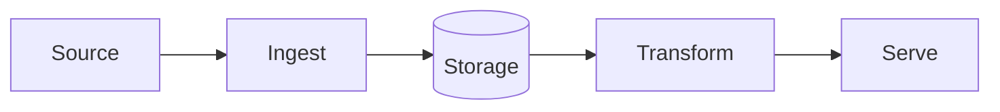

# Project Name

> One-sentence pitch: what problem this solves and for whom.

## Architecture



## Tech stack

| Layer | Choice | Why |
|---|---|---|
| Ingestion | | |
| Storage | | |
| Transformation | | |
| Orchestration | | |

## Run it

```bash
make setup
make test
```

## Cost & teardown

Cloud resources used, expected monthly cost (target: free tier) and how to remove everything:

```bash
make destroy
```

## Decisions

Architecture Decision Records live in [docs/decisions/](docs/decisions/).

## What I learned

- Concept — one line on the insight (second-brain note: `02 - Fundamentals/...`).
