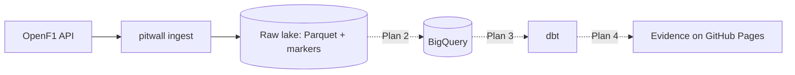

# pitwall

> Batch ELT over Formula 1 data (OpenF1 → GCS → BigQuery → dbt → Evidence) that explains race strategy — tyres, pit stops and the undercut — to people who don't follow F1.

## Architecture



## Tech stack

| Layer | Choice | Why |
|---|---|---|
| Ingestion | Python (httpx, pyarrow) | Small, testable, teaches rate limiting and idempotency — [ADR 0002](docs/decisions/0002-lake-first-custom-extractor.md) |
| Storage | Parquet lake (local now, GCS in Plan 2) | Replayable source of truth |
| Transformation | | |
| Orchestration | | |

## Run it

```bash
make setup
make test
make ingest ARGS="--meeting 1255"   # 2025 Chinese GP into .lake/
make ingest ARGS="--season 2024"    # backfill (~15 min: the API allows 30 requests/min)
```

## Cost & teardown

Cloud resources used, expected monthly cost (target: free tier) and how to remove everything:

```bash
make destroy
```

## Decisions

Architecture Decision Records live in [docs/decisions/](docs/decisions/).

## What I learned

- Concept — one line on the insight (second-brain note: `02 - Fundamentals/...`).
