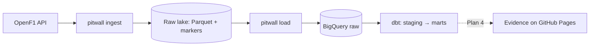

# pitwall

> Batch ELT over Formula 1 data (OpenF1 → GCS → BigQuery → dbt → Evidence) that explains race strategy — tyres, pit stops and the undercut — to people who don't follow F1.

## Architecture



## Tech stack

| Layer | Choice | Why |
|---|---|---|
| Ingestion | Python (httpx, pyarrow) | Small, testable, teaches rate limiting and idempotency — [ADR 0002](docs/decisions/0002-lake-first-custom-extractor.md) |
| Storage | Parquet lake on GCS (`gs://pitwall-tr-<env>-raw`) | Replayable source of truth |
| Warehouse | BigQuery (raw dataset, full reload) | Free tier, load jobs are free — [ADR 0003](docs/decisions/0003-gcp-two-projects-bigquery-only.md), [0004](docs/decisions/0004-full-reload-of-raw-tables.md) |
| Infrastructure | Terraform + `make bootstrap` | One root, workspace per env, no keys (Workload Identity Federation) |
| Transformation | dbt (BigQuery) | Tested SQL with stated grains; unit tests pin the racing rules |
| Orchestration | | |

## Run it

```bash
make setup && make test
# one-off per environment: GCP project + billing link + budget alert (5 in the account currency)
make bootstrap BILLING_ACCOUNT=XXXXXX-XXXXXX-XXXXXX ORG_ID=XXXXXXXXXXXX
make apply                          # ENV=dev by default
make ingest ARGS="--season 2025"    # OpenF1 → gs://pitwall-tr-dev-raw (~15 min: 30 requests/min limit)
make load                           # lake → BigQuery raw.openf1_* tables
make transform                      # dbt build: staging → intermediate → marts, with tests
PITWALL_LAKE_URI=.lake make ingest ARGS="--meeting 1255"   # offline: local lake
```

## F1 in one minute

| Term | Meaning |
|---|---|
| **Grand Prix (meeting)** | One race weekend at one circuit. |
| **Race / Sprint** | Sunday's full-distance race / Saturday's short race. pitwall analyses both. |
| **Compound** | Tyre type: SOFT (fast, wears quickly), MEDIUM, HARD (slow, durable), INTERMEDIATE/WET (rain). |
| **Stint** | Laps on one set of tyres, between two pit stops. |
| **Degradation** | Seconds per lap a car loses as its tyres wear. |
| **Pit stop** | Stop to change tyres: ~2–3 s stationary, ~20 s lost overall. |
| **Undercut** | Pitting before the car just ahead so that fresh tyres put you in front after they pit. |
| **Safety Car / VSC** | Everyone slows down after an incident, so pitting costs less. |

## Data model

| Model | One row is | Answers |
|---|---|---|
| `fct_laps` | a lap of a driver | pace, tyres and running order lap by lap |
| `fct_stints` | a set of tyres used by a driver | how fast each compound wears (degradation) |
| `fct_pit_stops` | a pit stop | when, how long, which tyres, positions lost |
| `fct_undercut_attempts` | an undercut attempt | did pitting first work? |
| `fct_session_results` | a driver's race result | grid vs finish |
| `dim_sessions`, `dim_meetings`, `dim_session_drivers` | a race / weekend / driver-in-race | names, dates, teams, colours |

Every column is documented in the dbt YAML (`transform/models/`); `dbt docs generate` renders it.

## Data quality

Ingestion rejects only structurally broken data (missing keys, wrong types). Everything else is
checked in dbt: impossible values (null keys, positions or points out of range) **fail** the build,
so the marts and the dashboard keep their last good version; unusual-but-real values **warn**. Every
failing row is stored in the BigQuery `audit` dataset.

Empty fields that are expected (not errors):

| Field | Empty when |
|---|---|
| `race_control.driver_number` | the message is not about one car (~80 %) |
| `race_control.flag`, `scope`, `sector` | the message is not a flag |
| `race_control.qualifying_phase` | always in races (qualifying only) |
| `session_result.position`, `gap_to_leader`, `duration` | the driver was not classified (DNF/DNS/DSQ) |
| `pit.stop_duration` | the stationary time was not measured |
| `laps.lap_duration`, `date_start` | timing gaps, mostly lap 1 and pit laps (< 1 %) |
| `drivers.country_code` | always — OpenF1 does not publish it (not modelled) |

Known source defects: a few stints with missing or inverted lap ranges (kept in staging, excluded
from `fct_stints`), and race-control messages that name a car in the text but not in `driver_number`.
Known real-race outliers that only warn: red-flag pit stops of up to 22 minutes, and wet weekends
(Miami 2025) with slightly more missing lap timings.

## Cost & teardown

Per environment: one GCP project with a GCS bucket (MBs), four BigQuery datasets, a service account
and a Workload Identity pool. **Expected cost: 0/month** — everything stays in the free tier.
Guards: a budget alert (warns at 50/90/100 % of 5 EUR) and a 50 GiB/day BigQuery query quota
(stops runaway queries; the default is 200 TiB/day).

```bash
make destroy ENV=dev                   # deletes everything Terraform created, lake data included
gcloud projects delete pitwall-tr-dev  # nuclear option: the project itself
```

## Decisions

Architecture Decision Records live in [docs/decisions/](docs/decisions/).

## What I learned

- Concept — one line on the insight (second-brain note: `02 - Fundamentals/...`).
