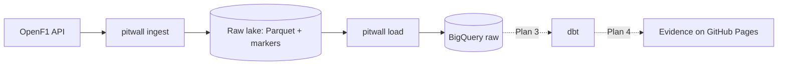

# pitwall

> Batch ELT over Formula 1 data (OpenF1 → GCS → BigQuery → dbt → Evidence) that explains race strategy — tyres, pit stops and the undercut — to people who don't follow F1.

## Architecture



## Tech stack

| Layer | Choice | Why |
|---|---|---|
| Ingestion | Python (httpx, pyarrow) | Small, testable, teaches rate limiting and idempotency — [ADR 0002](docs/decisions/0002-lake-first-custom-extractor.md) |
| Storage | Parquet lake on GCS (`gs://pitwall-tr-<env>-raw`) | Replayable source of truth |
| Warehouse | BigQuery (raw dataset, full reload) | Free tier, load jobs are free — [ADR 0003](docs/decisions/0003-gcp-two-projects-bigquery-only.md), [0004](docs/decisions/0004-full-reload-of-raw-tables.md) |
| Infrastructure | Terraform + `make bootstrap` | One root, workspace per env, no keys (Workload Identity Federation) |
| Transformation | | |
| Orchestration | | |

## Run it

```bash
make setup && make test
# one-off per environment: GCP project + billing link + budget alert (5 in the account currency)
make bootstrap BILLING_ACCOUNT=XXXXXX-XXXXXX-XXXXXX
make apply                          # ENV=dev by default
make ingest ARGS="--season 2025"    # OpenF1 → gs://pitwall-tr-dev-raw (~20 min: 30 requests/min limit)
make load                           # lake → BigQuery raw.openf1_* tables
PITWALL_LAKE_URI=.lake make ingest ARGS="--meeting 1255"   # offline: local lake
```

## Cost & teardown

Per environment: one GCP project with a GCS bucket (MBs), four BigQuery datasets, a service account
and a Workload Identity pool. **Expected cost: 0/month** — everything stays in the free tier.
Guards: a budget alert (warns at 50/90/100 % of 5 EUR) and a 50 GiB/day BigQuery query quota
(stops runaway queries; the default is 200 TiB/day).

```bash
make destroy ENV=dev                   # deletes everything Terraform created, lake data included
gcloud projects delete pitwall-tr-dev  # nuclear option: the project itself
```

## Decisions

Architecture Decision Records live in [docs/decisions/](docs/decisions/).

## What I learned

- Concept — one line on the insight (second-brain note: `02 - Fundamentals/...`).
